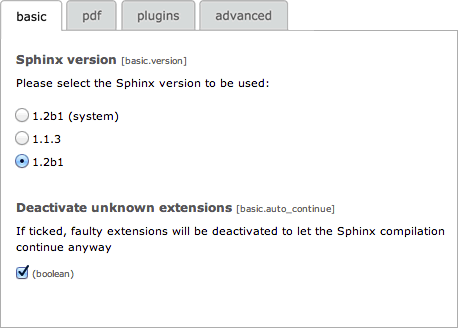
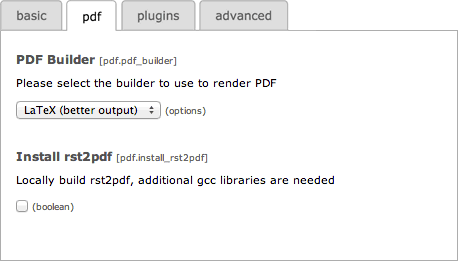

.. ==================================================
.. FOR YOUR INFORMATION
.. --------------------------------------------------
.. -*- coding: utf-8 -*- with BOM.

.. include:: ../../Includes.txt

Installing the extension
------------------------

There are a few steps necessary to install the Sphinx Python Documentation Generator and Viewer extension. If you have
installed other extensions in the past, you will run into little new here.

.. note::
	**MS Windows Users:** Please set up your environment with Python first. Instructions are available
	as :ref:`a separated chapter <windows-setup>`.

Installing the extension from Extension Manager
^^^^^^^^^^^^^^^^^^^^^^^^^^^^^^^^^^^^^^^^^^^^^^^

The Sphinx Python Documentation Generator and Viewer extension can be installed through the typical TYPO3 installation
process using the Extension Manager.

.. _configure-sphinx:

Downloading and configuring Sphinx
^^^^^^^^^^^^^^^^^^^^^^^^^^^^^^^^^^

In the Extension Manager, execute the update script this extension is providing:

Select a version of Sphinx you would like to use and start the import process with the "import" button:

.. important::
	If the list of available versions of Sphinx is empty, you most
	probably `lack OpenSSL support <http://wiki.typo3.org/Exception/CMS/1318283565>`_ in PHP (this is a typical pitfall
	under MS Windows).

.. index::
	single: Install; Log
	single: Install; Python Imaging Library
	single: Install; rst2pdf
	single: Install; PyYAML
	single: Install; Pygments
	single: Install; TYPO3 ReST Tools

Everything should work out-of-the-box. Possible problems will be reported as Flash messages and a log of all operations
is stored as :file:`typo3temp/tx_sphinx/IMPORT-{date}.log`. The general process of importing Sphinx is as follows:

#. Fetch the version as a zip archive from https://github.com/sphinx-doc/sphinx/releases into
   directory :file:`typo3temp/`

#. Unpack the zip archive into directory :file:`uploads/tx_sphinx/{version}/`

#. Build the Python libraries into directory :file:`typo3temp/tx_sphinx/sphinx-doc/{version}/`

#. *[Not on MS Windows, other OS : if activated]* Install Python Imaging Library (https://pypi.python.org/pypi/PIL),
   needed for supporting common image types with :program:`rst2pdf`

#. *[Not on MS Windows, other OS : if activated]* Install :program:`rst2pdf` (http://rst2pdf.ralsina.me/), as a
   simple way of building PDF

#. Fetch 3rd-party plugins for Sphinx: https://bitbucket.org/birkenfeld/sphinx-contrib/

#. Install PyYAML library (http://pyyaml.org/wiki/PyYAML), needed for building TYPO3 documentation

#. Install Pygments library (http://pygments.org/), and configure TypoScript highlighting

#. Install TYPO3-related commands provided by the TYPO3 Documentation Team

The manual process buttons let you locally change files and rebuild your environment. This is particularly useful if
you want to use the Git repositories of the TYPO3-related commands instead of a snapshot. Please note however that the
repositories will be automatically used if your system supports the :program:`git` command.

The "download" button fetches the corresponding sources of Sphinx, the TYPO3-related commands, the PyYAML library, the
Pygments library, ... if they are not available locally.

.. important::
	It is known that the Python Imaging Library and/or :program:`rst2pdf` might fail to be successfully installed and
	configured on some systems. However, as these libraries are only used to render PDF with :program:`rst2pdf` and as
	the recommended method for rendering PDF is to use :ref:`LaTeX <rendering-pdf>` anyway, you should not worry if you
	are unable to install :program:`rst2pdf` locally.

.. tip::
	If the command :program:`git` is detected on your system, the Git repository will be cloned instead of fetching once
	for all the TYPO3-related commands. However, if it fails, or if :program:`git` is not detected, it will fetch a
	snapshot instead. In such case, you may prefer to clone the official Git repository manually.

	To do so, open a terminal and run:

	.. code-block:: bash

		$ cd /path/to/uploads/tx_sphinx/
		$ rm -rf t3SphinxThemeRtd sphinxcontrib.t3fieldlisttable \
		    sphinxcontrib.t3tablerows sphinxcontrib.t3targets
		$ git clone https://github.com/TYPO3-Documentation/t3SphinxThemeRtd.git
		$ git clone https://github.com/TYPO3-Documentation/sphinxcontrib.t3fieldlisttable.git
		$ git clone https://github.com/TYPO3-Documentation/sphinxcontrib.t3tablerows.git
		$ git clone https://github.com/TYPO3-Documentation/sphinxcontrib.t3targets.git

The "build" button builds or rebuilds the corresponding version of the Sphinx environment with the TYPO3-related commands,
PyYAML, Pygments, Python Imaging Library and :program:`rst2pdf`. **Good to know:** TypoScript support for Pygments is
automatically updated, if needed, upon rebuilding your Sphinx environment.

Finally, the "remove" button removes both the sources and the corresponding version of the Sphinx environment.

.. important::
	This button *WILL NOT* remove sources of the TYPO3-related commands, the PyYAML library, Pygments, the Python Imaging
	Library or :program:`rst2pdf`.

Choosing the version of Sphinx
^^^^^^^^^^^^^^^^^^^^^^^^^^^^^^

In the Extension Manager, configure this extension as usual:

The first tab "basic" lets you choose which version of Sphinx should be used to render your documents:

Choosing how to render PDF
^^^^^^^^^^^^^^^^^^^^^^^^^^

.. index::
	single: PDF; LaTeX
	single: PDF; rst2pdf

The second tab "pdf" lets you choose which PDF builder you prefer (either :program:`rst2pdf` or LaTeX) and whether you
want to install and configure :program:`rst2pdf`:

.. tip::
	**Except for MS Windows users,** :program:`rst2pdf` is available by default with this extension. However, if you want
	better output, you should consider using LaTeX instead. Please read chapter :ref:`admin-rendering-pdf` for instructions.

.. _install-plugins:

Choosing the 3rd-party plugins to install
^^^^^^^^^^^^^^^^^^^^^^^^^^^^^^^^^^^^^^^^^

.. index::
	pair: Plugins; Google Chart
	pair: Plugins; Google Maps
	pair: Plugins; HTTP Domain
	pair: Plugins; YouTube
	pair: Plugins; Slideshare

The third tab "plugins" lets you activate additional Sphinx extensions. Some of them are available on
docs.typo3.org, and are as such suited for use with your extension manuals:

Please read chapter :ref:`third-party-plugins` for instructions on how to use them in your documents.

.. important::
	Make sure to :ref:`rebuild your Sphinx environment <configure-sphinx>` after activating new plugins.

.. _speed-up-rendering:

Speed-up rendering
^^^^^^^^^^^^^^^^^^

The fourth tab "advanced" lets you tweak advanced settings to speed-up the rendering.

