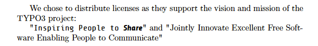

.. ==================================================
.. FOR YOUR INFORMATION
.. --------------------------------------------------
.. -*- coding: utf-8 -*- with BOM.

.. include:: ../../Includes.txt

.. _installing-share-font:

Installing the Share font
^^^^^^^^^^^^^^^^^^^^^^^^^

In order to customize the output of documentation rendered as PDF with LaTeX to match the TYPO3 branding, we first
need to install the `Share corporate font family`_ and convert it to be compatible with LaTeX. Instructions can be
found in the repository of the TYPO3-related commands for Sphinx, within directory :file:`LaTeX`.

.. _`Share corporate font family`: https://typo3.org/about/the-brand/style-guide/the-typo3-font/

Instead of just fetching this :file:`LaTeX` directory from the official repository, we suggest to replace the whole
:file:`RestTools` directory and use a clone of the whole Git repository:

.. code-block:: bash

	$ cd /path/to/uploads/tx_sphinx/
	$ sudo rm -rf RestTools
	$ git clone git://git.typo3.org/Documentation/RestTools.git

Then go to directory :file:`RestTools/LaTeX` and convert the Share font (the password that is being asked is related to
:command:`sudo`; as such it is your own password):

.. code-block:: bash

	$ cd /path/to/uploads/tx_sphinx/RestTools/LaTeX/
	$ cd font/
	$ ./convert-share.sh

.. tip::

	The complete Share font family can be downloaded off http://prdownloads.sourceforge.net/typo3/TYPO3_Share_Complete.zip?download.

.. note::

	**MS Windows Users:** Please use `Unicode Truetype font installer for LaTeX <http://william.famille-blum.org/software/latexttf/index.html>`__.
	As there is currently no automatic script available for you, when using MikTeX, please follow the instructions on the
	linked page or from http://www.radamir.com/tex/ttf-tex.htm.

	**Tip:** You may want to use script :program:`convert-share.sh` from a Linux machine and set ``INSTALL=0`` near the
	beginning of the script. Instead of installing the converted fonts on your system, it will only convert them and
	prepare mapping files within directory :file:`RestTools/LaTeX/fonts/texmf/`.

Once converted, the font is available as ``typo3share`` within LaTeX documents. To test that it has been properly
installed, you may create a sample LaTeX document, (:file:`test-font.tex`):

.. code-block:: latex

	\documentclass{article}

	\RequirePackage[utf8]{inputenc}
	\RequirePackage[T1]{fontenc}

	%% TYPO3 font
	\newcommand\sharefont{\fontfamily{typo3share}\selectfont}

	\begin{document}

	We chose to distribute licenses as they support the vision and
	mission of the TYPO3 project:

	"{\sharefont Inspiring People to \textbf{\emph{Share}}}" and
	"Jointly Innovate Excellent Free Software Enabling People to
	Communicate"

	\end{document}

and compile it:

.. code-block:: bash

	$ pdflatex test-font

When you open generated file :file:`test-font.pdf`, you should see the Share font used locally:

