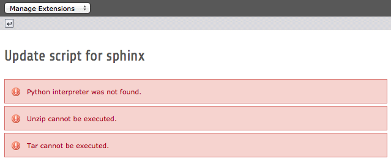

.. ==================================================
.. FOR YOUR INFORMATION
.. --------------------------------------------------
.. -*- coding: utf-8 -*- with BOM.

.. include:: ../../Includes.txt

.. _windows-setup:

MS Windows environment setup
----------------------------

Unlike most :abbr:`UN*X (Unix-like)` operating systems, MS Windows generally lacks a Python interpreter and a few
utilities being globally available.

As this extension requires Python, unzip and tar extraction utilities to be present, MS Windows users should first set
up their environment with the Python framework. On a vanilla Windows environment, when you run the update script of this
extension in Extension Manager by clicking on action icon |download_python| (|update_script| before TYPO3 6.2) you will
see a few error messages:

.. index::
	single: Error Message; Python interpreter was not found
	single: Error Message; Unzip cannot be executed
	single: Error Message; Tar cannot be executed

Following sections describe how to install:

- :ref:`Python <installing-python>`
- :ref:`Unzip <installing-unzip>`
- :ref:`Tar <installing-tar>`

.. note::
	These instructions have been tested under:

	- Microsoft Windows 7 Professional, 64 bit edition
	- `WampServer (64 bit & PHP 5.4) 2.2E <http://www.wampserver.com/#download-wrapper>`_
	- Python 2.x

.. tip::
	.. index::
		single: Error Message; MSVCR100.dll is missing from your computer

	Installation of WampServer may fail with an error message similar to:

	.. image:: ../../Images/msvcr100dll.png
		:alt: Missing Microsoft Visual C++ Redistributable

	This cryptic error message means that you need to install the Microsoft Visual C++ Redistributable which can easily
	be downloaded on the Microsoft website as x86 or x64 edition:

	- **32 bit:** http://www.microsoft.com/en-us/download/details.aspx?id=5555
	- **64 bit:** http://www.microsoft.com/en-us/download/details.aspx?id=14632

.. tip::
	.. index::
		single: ThreadStackSize

	When installing WampServer, the default ThreadStackSize is only 1 MB, which is not enough for TYPO3 Extension Manager
	to be loaded. To fix that, open :file:`httpd.conf` and append:

	.. code-block:: apacheconf

		<IfModule mpm_winnt_module>
		    ThreadStackSize 8388608
		</IfModule>

	This will allocate 8 MB for ThreadStackSize. Then restart Apache.

.. _installing-python:

Installing Python
^^^^^^^^^^^^^^^^^

Please go to http://www.python.org/download/releases/ and download the Python Windows Installer. As of writing,
Python 2.7.6 is known to be working properly. Then launch the installer and follow the instructions:

.. important::
	Option "Install for all users" is needed if your web server runs with another user.

.. index::
	single: PATH; Environment Variable (MS Windows)
	single: Environment Variable

After the setup completed successfully, you should register the :program:`python` command in ``%PATH%`` to be globally
available.

To do so, open Control Panel > System > Advanced system settings > Environment variables:

Find the system variable ``Path`` and edit it:

You should append the path to :program:`python`. By default it is stored under directory :file:`C:\\Python27\\`.

.. important::
	Put the path at the end of the existing list, after having inserted a path separator character which is, under
	MS Windows, a semi-colon.

.. tip::
	You will need to restart Apache in order for TYPO3 to detect :program:`python` as Apache reads the ``%PATH%`` only
	once at startup.

.. _installing-unzip:

Installing Unzip
^^^^^^^^^^^^^^^^

Please go to http://gnuwin32.sourceforge.net/packages/unzip.htm and download the setup file. Then launch the installer
and follow the instructions:

You should now register the :program:`unzip` command in ``%PATH%`` to be globally available. By default it is stored under
directory :file:`C:\\Program Files (x86)\\GnuWin32\\bin`. Please perform steps as in previous section.

.. _installing-tar:

Installing Tar
^^^^^^^^^^^^^^

Please go to http://gnuwin32.sourceforge.net/packages/libarchive.htm (LibArchive contains BsdTar) and download the setup
file. Then launch the installer and follow the instructions, as you did for :ref:`unzip <installing-unzip>`:

.. important::
	By default the :program:`bsdtar` extraction utility is stored under directory :file:`C:\\Program Files (x86)\\GnuWin32\\bin`,
	just as :program:`unzip`; it should thus be automatically detected as you already registered this path into the ``%PATH%``
	environment variable. If needed, please register an alternate path as described previously.

	In spite of that, extension Sphinx seeks for command :program:`tar` and not :program:`bsdtar`. As such, you should
	either copy :program:`bsdtar.exe` and rename it as :program:`tar.exe` or, better, create a symbolic link to it. Do
	do that, open a command (CMD) prompt *as administrator*:

	.. code-block:: bat

		C:\Windows\system32> cd "\Program Files (x86)\GnuWin32\bin"

		C:\Program Files (x86)\GnuWin32\bin> mklink tar.exe bsdtar.exe
		symbolic link created for tar.exe <<===>> bsdtar.exe

.. note::
	.. index::
		single: Error Message; Cannot fork: Function not implemented

	In case you wonder why we are using BsdTar instead of GNU Tar, here is why. In fact, a quick search for :program:`tar`
	for Windows leads to GNU Tar. However this package will be of no use since it cannot handle ``tar.gz`` files.
	Instead, it will crash with:

	.. code-block:: bat

		C:\> Cannot fork: Function not implemented
		C:\> Error is not recoverable: exiting now

	Besides, the Tar package itself recommends using BsdTar:

		The Win32 port can only create ``tar`` archives, but cannot pipe its output to other programs such as
		:program:`gzip` or :program:`compress`, and will not create ``tar.gz`` archives; you will have to use or simulate
		a batch pipe. BsdTar does have the ability to direcly create and manipulate ``.tar``, ``.tar.gz``, ``tar.bz2``,
		``.zip``, ``.gz`` and ``.bz2`` archives, understands the most-used options of GNU Tar, and is also much faster;
		for most purposes it is to be preferred to GNU Tar.

Congratulations! You should now be able to :ref:`configure the extension Sphinx <configure-sphinx>`!
