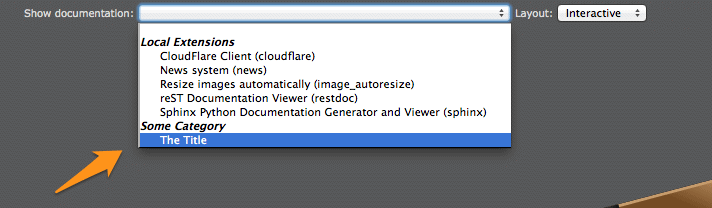

.. ==================================================
.. FOR YOUR INFORMATION
.. --------------------------------------------------
.. -*- coding: utf-8 -*- with BOM.

.. include:: ../../Includes.txt

.. _register-custom-documentation:

Registering Custom Documentation
^^^^^^^^^^^^^^^^^^^^^^^^^^^^^^^^

The two slots :ref:`afterInitializeReferences <custom-documentation-afterInitializeReferences>` and
:ref:`renderUserDocumentation <custom-documentation-renderUserDocumentation>` should be used to register and render your
own documentation. Please see :ref:`sample code below <custom-documentation-sample>`.

Slot :ref:`retrieveRestFilename <custom-documentation-retrieveRestFilename>` should be used if you plan to edit source
files using the integrated :ref:`reStructuredText editor <sphinx-documentation-editor>`.

.. tip::
	Before going on implementing signals to register your own documentation, make sure to read
	the :ref:`instructions to register a project <documentation-viewer-custom-project>` with the built-in facility. As a
	bonus, if you do so, your documentation will automatically show up in the documentation Backend module starting
	from TYPO3 6.2.

.. _custom-documentation-afterInitializeReferences:

Slot: afterInitializeReferences
"""""""""""""""""""""""""""""""

This slot is used to register additional entries in the drop-down list of available documentations.

Your slot should implement a method of the form:

.. code-block:: php

	public function postprocessReferences(array &$references) {
	    // Custom code
	}

Parameter ``$references`` is an bi-dimensional array containing the list of local, global and system extensions with a
Sphinx/reStructuredText-based documentation. As the array is passed by reference, you may post-process the array and
add/remove/modify
existing entries.

.. _custom-documentation-renderUserDocumentation:

Slot: renderUserDocumentation
"""""""""""""""""""""""""""""

This slot is used to render your custom documentation and return the URL of the master page.

Your slot should implement a method of the form:

.. code-block:: php

	public function render($identifier, $layout, $force, &$documentationUrl) {
	    // Custom code
	}

.. _custom-documentation-retrieveBasePath:

Slot: retrieveBasePath
""""""""""""""""""""""

This slot is used to retrieve the base path for the generated documentation corresponding to a given identifier.

Your  slot should implement a method of the form:

.. code-block:: php

	public function retrieveBasePath($identifier, &$path) {
	    // Custom code
	}

.. _custom-documentation-retrieveRestFilename:

Slot: retrieveRestFilename
""""""""""""""""""""""""""

This slot is used to retrieve the reStructuredText filename corresponding to a given document.

Your  slot should implement a method of the form:

.. code-block:: php

	public function retrieveRestFilename($identifier, $document, &$basePath, &$filename) {
	    // Custom code
	}

.. _custom-documentation-sample:

Sample code
"""""""""""

This sample code will register a custom documentation and simply return a public URL (http://www.example.com) as
"master page":

Registering the slots
~~~~~~~~~~~~~~~~~~~~~

In your extension, open :file:`EXT:{extension-key}/ext_localconf.php` and add:

.. code-block:: php

	/** @var \TYPO3\CMS\Extbase\SignalSlot\Dispatcher $signalSlotDispatcher */
	$signalSlotDispatcher = \TYPO3\CMS\Core\Utility\GeneralUtility::makeInstance(
	    'TYPO3\\CMS\\Extbase\\SignalSlot\\Dispatcher'
	);

	$signalSlotDispatcher->connect(
	    'Causal\\Sphinx\\Controller\\DocumentationController',
	    'afterInitializeReferences',
	    'Company\\MyExt\\Slots\\CustomDocumentation',
	    'postprocessReferences'
	);

	$signalSlotDispatcher->connect(
	    'Causal\\Sphinx\\Controller\\DocumentationController',
	    'renderUserDocumentation',
	    'Company\\MyExt\\Slots\\CustomDocumentation',
	    'render'
	);

	$signalSlotDispatcher->connect(
	    'Causal\\Sphinx\\Controller\\InteractiveViewerController',
	    'retrieveBasePath',
	    'Company\\MyExt\\Slots\\CustomDocumentation',
	    'retrieveBasePath'
	);

	/*
	$signalSlotDispatcher->connect(
	    'Causal\\Sphinx\\Controller\\RestEditorController',
	    'retrieveRestFilename',
	    'Company\\MyExt\\Slots\\CustomDocumentation',
	    'retrieveRestFilename'
	);
	*/

Implementing the slots
~~~~~~~~~~~~~~~~~~~~~~

In your extension, create a file :file:`EXT:{extension-key}/Classes/Slots/CustomDocumentation.php`:

.. code-block:: php

	<?php
	namespace Company\MyExt\Slots;

	class CustomDocumentation {

	    /**
	     * Registers the documentation.
	     *
	     * @param array &$references
	     * @return void
	     */
	    public function postprocessReferences(array &$references) {
	        $references['Some Category'] = array(
	            'USER:some-reference' => 'The Title',
	        );
	    }

	    /**
	     * Renders the documentation.
	     *
	     * @param string $identifier
	     * @param string $layout
	     * @param boolean $force
	     * @param string &$documentationUrl
	     * @return void
	     */
	    public function render($identifier, $layout, $force, &$documentationUrl) {
	        if ($identifier !== 'some-reference') {
	            return;
	        }

	        // TODO: render documentation and return an URL
	        //       (relative or absolute) to the master document
	        $documentationUrl = 'http://www.example.com';
	    }

	    /**
	     * Returns the base path for a given project identifier.
	     *
	     * @param string $identifier
	     * @param string &$path
	     */
	    public function retrieveBasePath($identifier, &$path) {
	        // Not yet implemented
	    }

	}

Example implementation of the TODO
~~~~~~~~~~~~~~~~~~~~~~~~~~~~~~~~~~

In example above, the actual rendering of an arbitrary documentation is not shown. Here is an example of a possible
implementation. We suppose that you have a TYPO3-based documentation project within directory :file:`fileadmin/demo-sphinx`
(e.g., generated with the :ref:`Sphinx Project Kickstarter <kickstart-sphinx-project>`); that is, a project where file
:file:`conf.py` is stored within a directory :file:`_make`:

.. code-block:: php

	public function render($identifier, $layout, $force, &$documentationUrl) {
	    if ($identifier !== 'some-reference') {
	        return;
	    }

	    $basePath = 'fileadmin/demo-sphinx/';
	    $buildDirectory = '_make/build/';
	    $confFilename = '_make/conf.py';

	    try {
	        switch ($layout) {
	            case 'html':	// Static
	                $masterFile = '_make/build/html/Index.html';
	                if ($force || !is_file($basePath . $masterFile)) {
	                    \Causal\Sphinx\Utility\SphinxBuilder::buildHtml(
	                        PATH_site . $basePath,
	                        '.',
	                        $buildDirectory,
	                        $confFilename
	                    );
	                }
	                $documentationUrl = '../' . $basePath . $masterFile;
	            break;
	            case 'json':	// Interactive
	                $masterFile = '_make/build/json/Index.fjson';
	                if ($force || !is_file($basePath . $masterFile)) {
	                    \Causal\Sphinx\Utility\SphinxBuilder::buildJson(
	                        PATH_site . $basePath,
	                        '.',
	                        $buildDirectory,
	                        $confFilename
	                    );
	                }
	                $documentationUrl = '../' . $basePath . $masterFile;
	            break;
	            case 'pdf':
	            default:
	                throw new \RuntimeException(
	                    'Sorry! Layout ' . $layout . ' is not yet supported', 1371415095
	                );
	        }
	    } catch (\RuntimeException $e) {
	        $filename = 'typo3temp/tx_myext_' . $e->getCode() . '.log';
	        $content = $e->getMessage();
	        \TYPO3\CMS\Core\Utility\GeneralUtility::writeFile(PATH_site . $filename, $content);
	        $documentationUrl = '../' . $filename;
	    }
	}

Please see method :php:`\Causal\Sphinx\Utility\GeneralUtility::generateDocumentation()` and class
:php:`\Causal\Sphinx\Slots\CustomProject` for further ideas.
