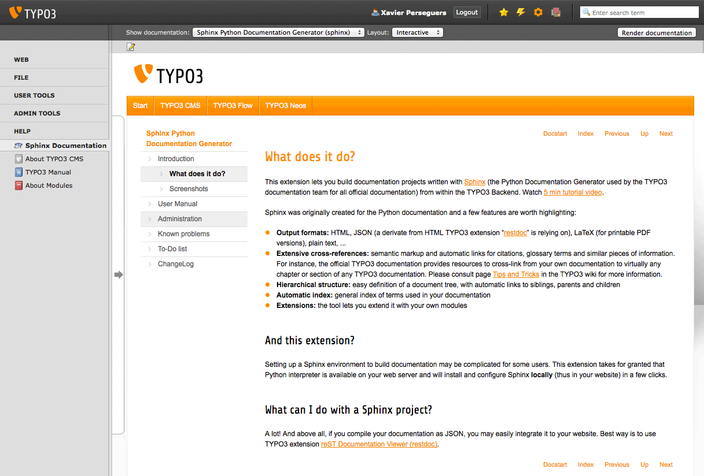
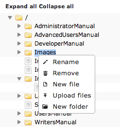

.. ==================================================
.. FOR YOUR INFORMATION
.. --------------------------------------------------
.. -*- coding: utf-8 -*- with BOM.

.. include:: ../Includes.txt

.. _introduction:

Introduction
============

.. _what-it-does:

What does it do?
----------------

.. only:: latex or missing_sphinxcontrib_youtube

	This extension lets you build documentation projects written with Sphinx_ (the Python Documentation Generator used
	by the TYPO3 documentation team for all official documentation) from within the TYPO3 backend.
	Watch `5 min tutorial video`_.

.. only:: html and not missing_sphinxcontrib_youtube

	This extension lets you build documentation projects written with Sphinx_ (the Python Documentation Generator used
	by the TYPO3 documentation team for all official documentation) from within the TYPO3 backend:

	.. youtube:: YeGqHMDT7R8
		:width: 100%

	|

Sphinx was originally created for the Python documentation and a few features are worth highlighting:

- **Output formats:** HTML, JSON (a derivate from HTML :ter:`restdoc` is relying on), LaTeX (for printable PDF versions), plain text, ...

- **Extensive cross-references:** semantic markup and automatic links for citations, glossary terms and similar pieces of information. For instance, the official TYPO3 documentation provides resources to cross-link from your own documentation to virtually any chapter or section of any TYPO3 documentation. Please consult page `Tips and Tricks`_ in the TYPO3 wiki for more information.

- **Hierarchical structure:** easy definition of a document tree, with automatic links to siblings, parents and children

- **Automatic index:** general index of terms used in your documentation

- **Extensions:** the tool lets you extend it with your own modules

.. Links:
.. _`5 min tutorial video`: https://www.youtube.com/watch?v=YeGqHMDT7R8

.. _Sphinx: http://sphinx-doc.org/

.. _`the TYPO3 wiki`: http://wiki.typo3.org/Rendering_reST

.. _`Tips and Tricks`: http://wiki.typo3.org/Tips_and_Tricks_%28reST%29

And this extension?
^^^^^^^^^^^^^^^^^^^

Setting up a Sphinx environment to build documentation may be complicated for some users. This extension takes for
granted that Python interpreter is available on your web server and will install and configure Sphinx **locally** (thus
in your website) in a few clicks.

In addition, this extension comes with a few goodies such as:

- Backend documentation viewer
- Backend module to kickstart and render custom documentation project
- Extends TYPO3 6.2 to render extension manuals on demand
- Integrated reStructuredText editor
- Wizard to convert an OpenOffice document (:file:`manual.sxw`) to a Sphinx project (using an online tool
  on https://docs.typo3.org)

What can I do with a Sphinx project?
^^^^^^^^^^^^^^^^^^^^^^^^^^^^^^^^^^^^

A lot! And above all, if you compile your documentation as JSON, you may easily integrate it to your website. Best way
is to use TYPO3 extension :ter:`Sphinx Documentation Viewer Plugin (restdoc) <restdoc>`.

.. _screenshots:

Screenshots
-----------

	The integrated viewer lets you browse manuals from TYPO3 backend and edit them right away.

.. figure:: ../Images/wizard-new-project.png
	:alt: Wizard to create custom projects

	The new project wizard lets you reference existing documentation projects and create new ones, either based on
	standard templates or by cloning an external Git repository (handy to work on official TYPO3 manuals).

.. figure:: ../Images/rest-editor.png
	:alt: reStructuredText editor

	The built-in reStructuredText editor with syntax highlighting lets you easily modify your documents and to
	cross-link to other manuals.

	A context menu for files and folders in the project tree lets you create empty files, upload files and images from
	your local drive and rename or remove them at the same place. If you project is under revision control (a.k.a.
	version control) with Git, then all those management operations will take advantage of it and use the corresponding
	commands instead of bare OS ones.
