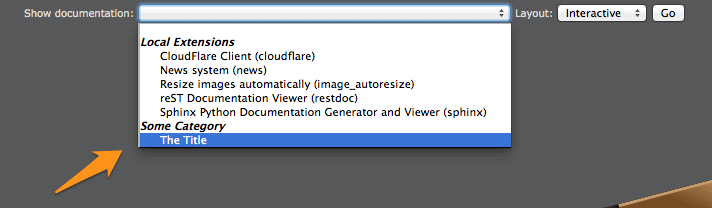

.. ==================================================
.. FOR YOUR INFORMATION
.. --------------------------------------------------
.. -*- coding: utf-8 -*- with BOM.

.. include:: ../../../Includes.txt

.. _register-custom-documentation:

Enregistrement d'une documentation personnalisée
^^^^^^^^^^^^^^^^^^^^^^^^^^^^^^^^^^^^^^^^^^^^^^^^

Les deux slots :ref:`afterInitializeReferences <custom-documentation-afterInitializeReferences>` et
:ref:`renderUserDocumentation <custom-documentation-renderUserDocumentation>` peuvent être utilisés pour enregistrer et
générer votre propre documentation. Veuillez regarder l':ref:`exemple de code ci-dessous <custom-documentation-sample>`.

Le slot :ref:`retrieveRestFilename <custom-documentation-retrieveRestFilename>` peut être utilisé si vous envisagez de
permettre l'édition des fichiers sources avec l':ref:`éditeur reStructuredText <sphinx-documentation-editor>` intégré.

.. tip::
	Avant de vous lancer dans l'implémentation de signaux pour enregistrer votre propre documentation, assurez-vous de
	lire les :ref:`instructions pour enregistrer un projet <documentation-viewer-custom-project>` avec le mécanisme
	intégré. En prime, si vous le faites ainsi, votre documentation apparaîtra automatiquement dans le module backend
	de documentation à partir de TYPO3 6.2.

.. _custom-documentation-afterInitializeReferences:

Slot : afterInitializeReferences
""""""""""""""""""""""""""""""""

Ce slot peut être utilisé pour enregistrer des entrées supplémentaires dans la liste déroulante des documentations
disponibles.

Votre slot doit implémenter une méthode de la forme :

.. code-block:: php

	public function postprocessReferences(array &$references) {
	    // Custom code
	}

Le paramètre ``$references`` est un tableau bidimensionnel contenant une liste d'extensions locales, globales et systèmes
dont la documentation est écrite avec Sphinx/reStructuredText. Puisque le tableau est passé par référence, vous pouvez
faire du post-traitement dessus et ajouter/supprimer/modifier les entrées existantes.

.. _custom-documentation-renderUserDocumentation:

Slot : renderUserDocumentation
""""""""""""""""""""""""""""""

Ce slot peut être utilisé pour générer votre propre documentation et doit retourner l'URL de la page principale.

Votre slot doit implémenter une méthode de la forme :

.. code-block:: php

	public function render($identifier, $layout, $force, &$documentationUrl) {
	    // Custom code
	}

.. _custom-documentation-retrieveBasePath:

Slot : retrieveBasePath
"""""""""""""""""""""""

Ce slot peut être utilisé pour récupérer le chemin de base de la documentation générée correspondant à un idenfiant
donnée.

Votre slot doit implémenter une méthode de la forme :

.. code-block:: php

	public function retrieveBasePath($identifier, &$path) {
	    // Custom code
	}

.. _custom-documentation-retrieveRestFilename:

Slot : retrieveRestFilename
"""""""""""""""""""""""""""

Ce slot peut être utilisé pour récupérer le nom de fichier reStructuredText correspondant à un document donné.

Votre slot doit implémenter une méthode de la forme :

.. code-block:: php

	public function retrieveRestFilename($identifier, $document, &$basePath, &$filename) {
	    // Custom code
	}

.. _custom-documentation-sample:

Code exemple
""""""""""""

Ce code exemple enregistre une documentation personnelle and retourne simplement une URL publique (http://www.example.com)
comme "page principale".

Enregistrement des slots
~~~~~~~~~~~~~~~~~~~~~~~~

Dans votre extension, ouvrez :file:`EXT:{extension-key}/ext_localconf.php` et ajoutez :

.. code-block:: php

	/** @var \TYPO3\CMS\Extbase\SignalSlot\Dispatcher $signalSlotDispatcher */
	$signalSlotDispatcher = \TYPO3\CMS\Core\Utility\GeneralUtility::makeInstance(
	    'TYPO3\\CMS\\Extbase\\SignalSlot\\Dispatcher'
	);

	$signalSlotDispatcher->connect(
	    'Causal\\Sphinx\\Controller\\DocumentationController',
	    'afterInitializeReferences',
	    'Company\\MyExt\\Slots\\CustomDocumentation',
	    'postprocessReferences'
	);

	$signalSlotDispatcher->connect(
	    'Causal\\Sphinx\\Controller\\DocumentationController',
	    'renderUserDocumentation',
	    'Company\\MyExt\\Slots\\CustomDocumentation',
	    'render'
	);

	$signalSlotDispatcher->connect(
	    'Causal\\Sphinx\\Controller\\InteractiveViewerController',
	    'retrieveBasePath',
	    'Company\\MyExt\\Slots\\CustomDocumentation',
	    'retrieveBasePath'
	);

	/*
	$signalSlotDispatcher->connect(
	    'Causal\\Sphinx\\Controller\\RestEditorController',
	    'retrieveRestFilename',
	    'Company\\MyExt\\Slots\\CustomDocumentation',
	    'retrieveRestFilename'
	);
	*/

Impémentation des slots
~~~~~~~~~~~~~~~~~~~~~~~

Dans votre extension, créez un fichier `EXT:{extension-key}/Classes/Slots/CustomDocumentation.php` :

.. code-block:: php

	<?php
	namespace Company\MyExt\Slots;

	class CustomDocumentation {

	    /**
	     * Registers the documentation.
	     *
	     * @param array &$references
	     * @return void
	     */
	    public function postprocessReferences(array &$references) {
	        $references['Some Category'] = array(
	            'USER:some-reference' => 'The Title',
	        );
	    }

	    /**
	     * Renders the documentation.
	     *
	     * @param string $identifier
	     * @param string $layout
	     * @param boolean $force
	     * @param string &$documentationUrl
	     * @return void
	     */
	    public function render($identifier, $layout, $force, &$documentationUrl) {
	        if ($identifier !== 'some-reference') {
	            return;
	        }

	        // TODO: render documentation and return an URL
	        //       (relative or absolute) to the master document
	        $documentationUrl = 'http://www.example.com';
	    }

	    /**
	     * Returns the base path for a given project identifier.
	     *
	     * @param string $identifier
	     * @param string &$path
	     */
	    public function retrieveBasePath($identifier, &$path) {
	        // Not yet implemented
	    }

	}

Exemple d'implémentation de la partie TODO
~~~~~~~~~~~~~~~~~~~~~~~~~~~~~~~~~~~~~~~~~~

Dans l'exemple précédent, la génération en tant que telle d'une documentation arbitraire n'est pas montrée. Voici un
exemple d'une implémentation possible de cette génération. Nous supposons que vous avez un projet de documentation basé
sur le modèle TYPO3 dans le répertoire :file:`fileadmin/demo-sphinx` (p. ex. généré avec
l':ref:`assistant de nouveau projet Sphinx <kickstart-sphinx-project>`) ; c.-à-d. un projet dont le fichier
:file:`conf.py` est stocké dans le répertoire :file:`_make` :

.. code-block:: php

	public function render($identifier, $layout, $force, &$documentationUrl) {
	    if ($identifier !== 'some-reference') {
	        return;
	    }

	    $basePath = 'fileadmin/demo-sphinx/';
	    $buildDirectory = '_make/build/';
	    $confFilename = '_make/conf.py';

	    try {
	        switch ($layout) {
	            case 'html':	// Static
	                $masterFile = '_make/build/html/Index.html';
	                if ($force || !is_file($basePath . $masterFile)) {
	                    \Causal\Sphinx\Utility\SphinxBuilder::buildHtml(
	                        PATH_site . $basePath,
	                        '.',
	                        $buildDirectory,
	                        $confFilename
	                    );
	                }
	                $documentationUrl = '../' . $basePath . $masterFile;
	            break;
	            case 'json':	// Interactive
	                $masterFile = '_make/build/json/Index.fjson';
	                if ($force || !is_file($basePath . $masterFile)) {
	                    \Causal\Sphinx\Utility\SphinxBuilder::buildJson(
	                        PATH_site . $basePath,
	                        '.',
	                        $buildDirectory,
	                        $confFilename
	                    );
	                }
	                $documentationUrl = '../' . $basePath . $masterFile;
	            break;
	            case 'pdf':
	            default:
	                throw new \RuntimeException(
	                    'Sorry! Layout ' . $layout . ' is not yet supported', 1371415095
	                );
	        }
	    } catch (\RuntimeException $e) {
	        $filename = 'typo3temp/tx_myext_' . $e->getCode() . '.log';
	        $content = $e->getMessage();
	        \TYPO3\CMS\Core\Utility\GeneralUtility::writeFile(PATH_site . $filename, $content);
	        $documentationUrl = '../' . $filename;
	    }
	}

Vous pouvez analyser la méthode :php:`\Causal\Sphinx\Utility\GeneralUtility::generateDocumentation()` et la classe
:php:`\Causal\Sphinx\Slots\CustomProject` pour d'autres idées d'implémentation.
