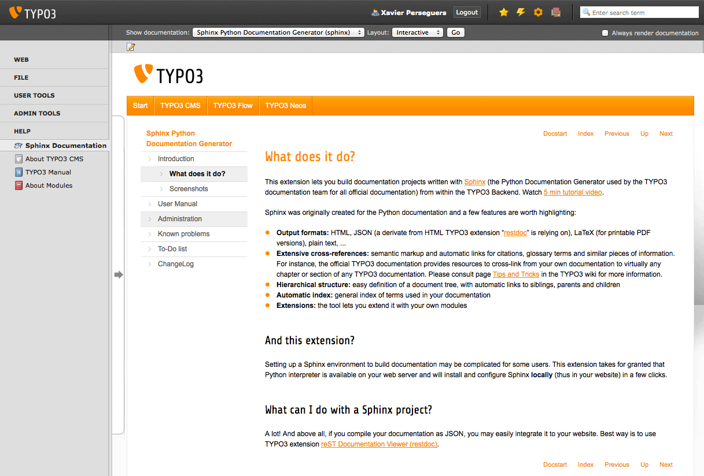
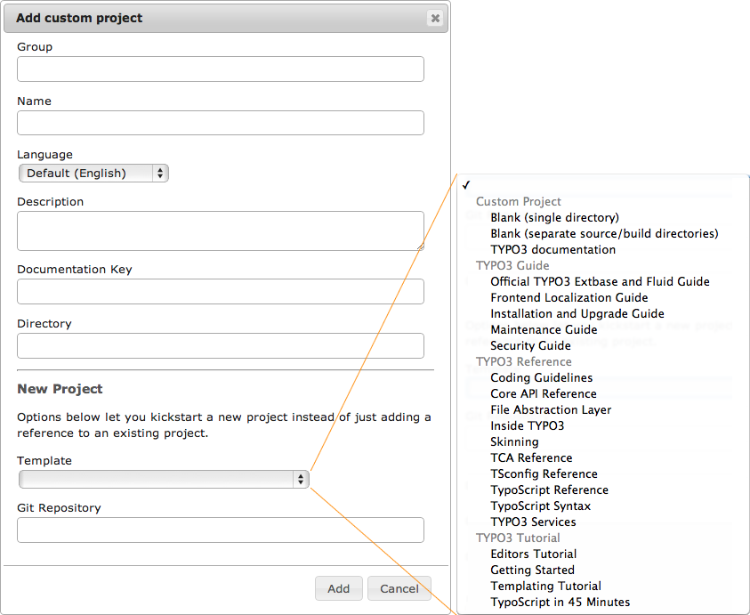
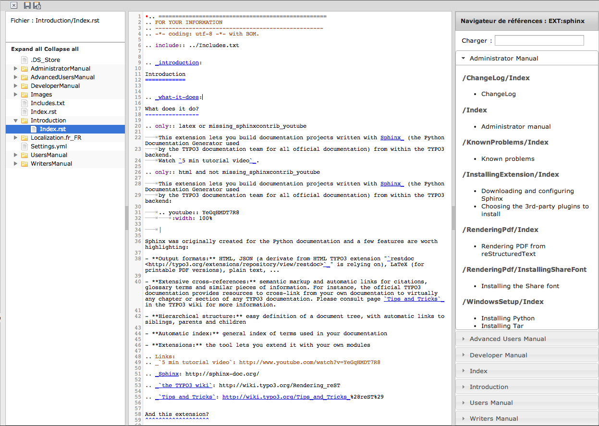
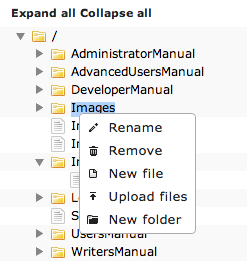

.. ==================================================
.. FOR YOUR INFORMATION
.. --------------------------------------------------
.. -*- coding: utf-8 -*- with BOM.

.. include:: ../../Includes.txt

.. _introduction:

Présentation
============

.. _what-it-does:

Qu'est-ce que ça fait ?
-----------------------

.. only:: latex or missing_sphinxcontrib_youtube

	Cette extension vous permet de générer des projets de documentation écrits avec Sphinx_ (le générateur de
	documentation Python que l'équipe de documentation de TYPO3 a choisi pour tous les manuels officiels) depuis le
	backend de TYPO3. Regarder le `tutoriel vidéo de 5 min`_ (anglais).

.. only:: html and not missing_sphinxcontrib_youtube

	Cette extension vous permet de générer des projets de documentation écrits avec Sphinx_ (le générateur de
	documentation Python que l'équipe de documentation de TYPO3 a choisi pour tous les manuels officiels) depuis le
	backend de TYPO3 :

	.. youtube:: YeGqHMDT7R8
		:width: 100%

	|

Sphinx a été créé à l'origine pour préparer la documentation Python et certaines caractéristiques valent la peine d'être
mises en évidence :

- **Formats de sortie :** HTML, JSON (un dérivé de HTML utilisé par l':ter:`restdoc`, LaTeX (pour une version PDF imprimable), texte simple, ...

- **Références croisées :** balisage sémantique et liens automatiques pour les citations, glossaire de termes et éléments
  d'information similaires. Par exemple, la documentation officielle de TYPO3 offre des ressources pour référencer
  n'importe quel chapitre ou section d'une documentation officielle TYPO3 depuis vos propres documents. Pour plus
  d'informations, veuillez consulter la page `Trucs et astuces <http://wiki.typo3.org/Tips_and_Tricks_%28reST%29>`_
  (anglais) dans le wiki de TYPO3

- **Structure hiérarchique :** définition simple d'une arborescence de documentation, avec liens automatiques vers les
  documents frères, parents ou fils

- **Index automatique :** index général des termes utilisés dans votre documentation

- **Extensions :** l'outil vous permet de l'étendre avec vos propres modules

.. Liens :
.. _`tutoriel vidéo de 5 min`: http://www.youtube.com/watch?v=YeGqHMDT7R8

.. _Sphinx: http://sphinx-doc.org/

Et cette extension ?
^^^^^^^^^^^^^^^^^^^^

La mise en place d'un environnement Sphinx pour générer de la documentation peut être compliqué aux yeux de certains
utilisateurs. Cette extension part du principe qu'un interpréteur Python est disponible sur votre serveur web et se
charge d'installer et de configurer Sphinx **localement** (c.-à-d. dans votre site) en quelques clics.

Par ailleurs, cette extension fournit quelques utilitaires comme :

- Une visionneuse de documentation en backend
- Un module de création et de rendu de projets de documentation personnalisés
- Étend TYPO3 6.2 pour générer les manuels des extensions à la demande
- Un éditeur reStructuredText intégré
- Un assistant pour convertir un document OpenOffice (:file:`manual.sxw`) en un projet Sphinx (à l'aide d'un utilitaire
  en ligne disponible sur http://docs.typo3.org)

Que puis-je faire avec un project Sphinx ?
^^^^^^^^^^^^^^^^^^^^^^^^^^^^^^^^^^^^^^^^^^

Plein de choses ! Et avant tout, si vous compilez votre documentation en JSON, vous pouvez facilement l'intégrer à votre
site. Le meilleur moyen est d'utiliser l'extension
TYPO3 :ter:`Sphinx Documentation Viewer Plugin (restdoc) <restdoc>`.

.. _screenshots:

Copies d'écran
--------------

	La visionneuse intégrée vous permet de parcourir les manuels depuis le backend TYPO3 et de les modifier directement.

	L'assistant de nouveau projet vous permet de référencer des projets de documentation existants et d'en créer de
	nouveaux, soit basé sur des modèles ou en clonant un dépôt Git externe (pratique pour travailler sur les manuels
	officiels TYPO3).

	L'éditeur reStructuredText intégré avec coloration syntaxique vous permet de modifier facilement vos documents et de
	faire des références croisées vers d'autres manuels.

	Un menu contextuel pour les fichiers et les dossiers est à disposition dans l'arborescence du projet et vous permet
	de créer de nouveaux fichiers, de télécharger/mettre en ligne des fichiers et des images depuis votre disque local
	et de les nenommer ou les supprimer. Si votre projet utilise Git comme système de gestion de versions, alors toutes
	ces opérations seront effectuées avec les commandes correspondantes au lieu des commandes simples de votre système
	d'exploitation.
