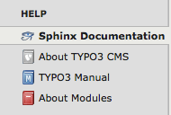
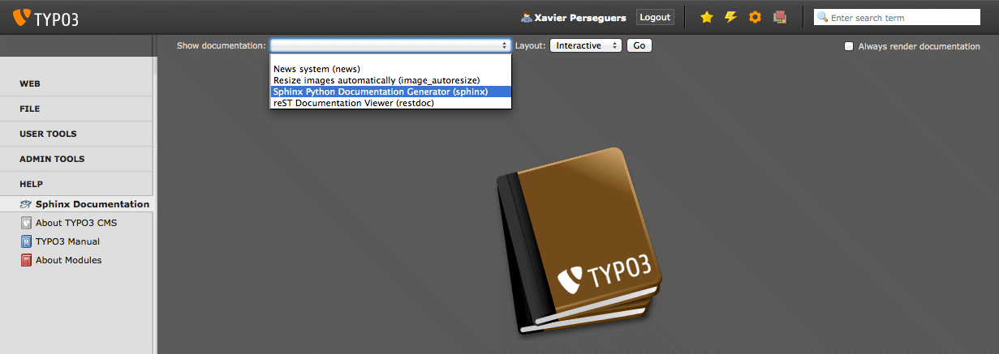
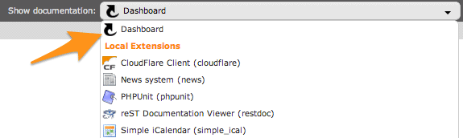
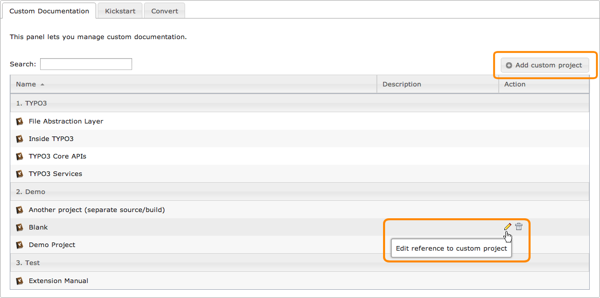
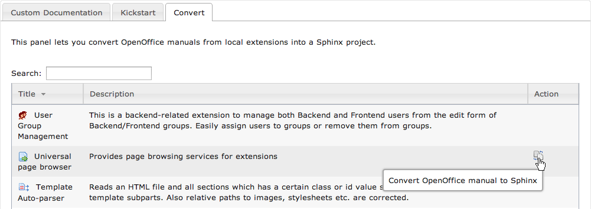
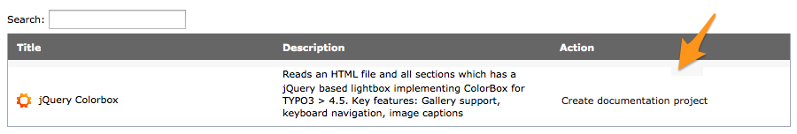

.. ==================================================
.. FOR YOUR INFORMATION
.. --------------------------------------------------
.. -*- coding: utf-8 -*- with BOM.

.. include:: ../../../Includes.txt

.. _sphinx-documentation-viewer:

Visionneuse de documentation Sphinx
-----------------------------------

Cette extension fournit un module backend dans la partie "Aide" :

Une liste déroulant tout en haut affiche les extensions utilisées qui contiennent une documentation basée sur Sphinx et
vous permet de rapidement l'afficher **localement** :

.. tip::
	La visionneuse de documentation Sphinx recharge automatiquement le dernier manuel que vous avez sélectionné et si
	vous choisissez le gabarit interactif, il va même vous ramener au chapitre que vous lisiez.

.. _dashboard:
.. _documentation-viewer-custom-project:
.. _kickstart-sphinx-project:

Tableau de bord
^^^^^^^^^^^^^^^

.. index::
	single: Tableau de bord; Créer un projet personnalisé
	single: Tableau de bord: Nouveau manuel pour une extension
	single: Tableau de bord; Convertir depuis OpenOffice
	single: Projet personnalisé
	single: Manuel; Nouveau manuel pour une extension
	single: OpenOffice; Convertir vers Sphinx

Si aucune documentation n'est sélectionnée dans la liste déroulante, c.-à-d. que "Tableau de bord" (*Dashboard*) est
sélectionné :

une liste de projets personnalisés peut être gérée :

Ensuite, en fonction de votre environnement, jusqu'à deux onglets supplémentaires peuvent être montrés. L'un vous montre
une liste d'extensions utilisées ne contenant qu'un manuel OpenOffice. Des icônes d'action vous permettent de facilement
convertir leur manuel en Sphinx à l'aide d'un convertisseur OpenOffice vers Sphinx intégré à cette extension :

De façon similaire, un projet de documention Sphinx vide peut être créé pour les extensions qui n'ont pas encore de
manuel :

.. _layouts:

Gabarits
^^^^^^^^

Les manuels d'extensions peuvent être générés avec différents "gabarits" :

- **Statique:** Génère et affiche une version HTML ;

- **Interactif:** Génère et affiche une version JSON qui nécessite donc
  l'extension :ter:`Sphinx Documentation Viewer Plugin (restdoc) <restdoc>`.
  Par ailleurs, ce gabarit propose un :ref:`éditeur reStructuredText <sphinx-documentation-editor>` intégré pour vous
  permettre de modifier rapidement et de recompiler un chapitre donné ;

- **PDF:** Génère et affiche une version PDF et de ce fait nécessite soit :program:`pdflatex` soit :program:`rst2pdf` :

  .. figure:: ../../../Images/render_pdf.png
      :alt: Génération d'une documentation en PDF

Fonctionnement interne
^^^^^^^^^^^^^^^^^^^^^^

Comme les manuels d'extensions basés sur Sphinx sont destinés à être générés sur https://docs.typo3.org en utilisant la
mise en page officielle de TYPO3, ils ne fournissent pas les fichiers de configuration généraux nécessaires à un rendu
local.

Lorsque vous sélectionnez un manuel d'extension à afficher dans la liste déroulante, le processus suivant intervient :

- Si une version en cache du document principal est trouvée, la visionneuse la charge directement et ne génère pas à
  nouveau la documentation.

Sinon :

#. Un projet Sphinx vide est instancié dans le répertoire :file:`typo3temp/tx_sphinx/{extension-key}` et tous les fichiers
   présents dans le répertoire :file:`EXT:{extension-key}/Documentation` y sont recopiés

#. Le projet Sphinx est généré en HTML, JSON ou PDF, selon le gabarit sélectionné

#. Le rendu HTML, JSON ou PDF est copié dans le répertoire
   :file:`typo3conf/documentation/{extension-key}/` :file:`{langue}/{format}/` (``langue`` est toujours "default" pour
   l'anglais, sauf si une documentation multilingue est trouvée, comme c'est le cas avec cette extension pour la version
   française que vous êtes en train de lire)

#. La visionneuse charge le document principal (p. ex. :file:`Index.html` si le rendu est HTML)

|

.. tip::
	Un bouton à droite vous permet de forcer le manuel d'extension à être généré à nouveau (ce qui recrée par
	conséquent la version mise en cache) :

	.. image:: ../../../Images/render-again.png
		:alt: Bouton pour forcer un manuel d'extension à être généré

.. note::
	La visionneuse de documentation Sphinx supporte deux types de manuels d'extensions :

	#. Structure de documentation standard avec un projet Sphinx complet stocké dans le répertoire
	   :file:`EXT:{extension-key}/Documentation/`, et un document principal nommé :file:`Index.rst`
	#. Simple fichier reStructuredText README comme on le voit sur Github ou Bitbucket et sauvegardé sous
	   :file:`EXT:{extension-key}/README.rst`

En fonction du gabarit choisi, le document principal est :

- **Statique:** Le document principal en HTML est :file:`typo3conf/Documentation/{extension-key}/` :file:`default/html/Index.html`

- **Interactif:** Le document principal en JSON est :file:`typo3conf/Documentation/{extension-key}/` :file:`default/json/Index.fjson`

- **PDF:** Le document principal en PDF est :file:`typo3conf/Documentation/{extension-key}/` :file:`default/pdf/<extension-key>.pdf`
