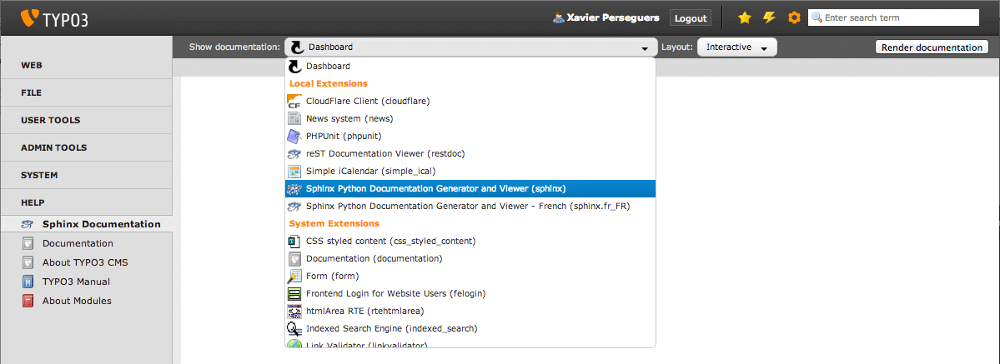

.. ==================================================
.. FOR YOUR INFORMATION
.. --------------------------------------------------
.. -*- coding: utf-8 -*- with BOM.

.. include:: ../../../Includes.txt

.. _sphinx-documentation-viewer:

Visionneuse de documentation Sphinx
-----------------------------------

Cette extension fournit un module backend dans la partie "Aide" :

.. figure:: ../../../Images/section_help.png
	:alt: Visionneuse de documentation Sphinx

Une liste déroulant tout en haut affiche les extensions utilisées qui contiennent une documentation basée sur Sphinx et
vous permet de rapidement l'afficher **localement** :

.. tip::
	La visionneuse de documentation Sphinx recharge automatiquement le dernier manuel que vous avez sélectionné et si
	vous choisissez le gabarit interactif, il va même vous ramener au chapitre que vous lisiez.

.. _kickstart-sphinx-project:

Tableau de bord
^^^^^^^^^^^^^^^

Si aucune documentation n'est sélectionnée dans la liste déroulante, c.-à-d. que "Tableau de bord" (*Dashboard*) est
sélectionné :

.. figure:: ../../../Images/kickstart.png
	:alt: Aucune documentation sélectionnée

une liste d'extensions utilisées contenant uniquement un manuel OpenOffice est affichée et vous permet de facilement le
convertir en Sphinx à l'aide d'un outil en ligne disponible sur http://docs.typo3.org :

.. figure:: ../../../Images/convert-openoffice.png
	:alt: Conversion facile des manuels OpenOffice en projets Sphinx
	:width: 711

De façon similaire, un projet de documention Sphinx vide peut être créé pour les extensions qui n'ont pas encore de
manuel :

.. figure:: ../../../Images/kickstart-sphinx.png
	:alt: Démarrer un projet de documentation Sphinx
	:width: 711

.. _layouts:

Gabarits
^^^^^^^^

Les manuels d'extensions peuvent être générés avec différents "gabarits" :

- **Statique:** Génère et affiche une version HTML ;

- **Interactif:** Génère et affiche une version JSON qui nécessite donc l'extension `Sphinx/reStructuredText Documentation Viewer (restdoc)`_.
  Par ailleurs, ce gabarit propose un :ref:`éditeur reStructuredText <sphinx-documentation-editor>` intégré pour vous
  permettre de modifier rapidement et de recompiler un chapitre donné ;

- **PDF:** Génère et affiche une version PDF et de ce fait nécessite soit :program:`pdflatex` soit :program:`rst2pdf` :

  .. figure:: ../../../Images/render_pdf.png
      :alt: Génération d'une documentation en PDF
      :width: 691

.. _`Sphinx/reStructuredText Documentation Viewer (restdoc)`: http://typo3.org/extensions/repository/view/restdoc

Fonctionnement interne
^^^^^^^^^^^^^^^^^^^^^^

Comme les manuels d'extensions basés sur Sphinx sont destinés à être générés sur http://docs.typo3.org en utilisant la
mise en page officielle de TYPO3, ils ne fournissent pas les fichiers de configuration généraux nécessaires à un rendu
local.

Lorsque vous sélectionnez un manuel d'extension à afficher dans la liste déroulante, le processus suivant intervient :

- Si une version en cache du document principal est trouvée, la visionneuse la charge directement et ne génère pas à
  nouveau la documentation.

Sinon :

#. Un projet Sphinx vide est instancié dans le répertoire :file:`typo3temp/tx_sphinx/{extension-key}` et tous les fichiers
   présents dans le répertoire :file:`EXT:{extension-key}/Documentation` y sont recopiés

#. Le projet Sphinx est généré en HTML, JSON ou PDF, selon le gabarit sélectionné

#. Le rendu HTML, JSON ou PDF est copié dans le répertoire
   :file:`typo3conf/documentation/{extension-key}/` :file:`{langue}/{format}/` (``langue`` est toujours "default" pour
   l'anglais, sauf si une documentation multilingue est trouvée, comme c'est le cas avec cette extension pour la version
   française que vous êtes en train de lire)

#. La visionneuse charge le document principal (p. ex. :file:`Index.html` si le rendu est HTML)

|

.. tip::
	Une case à cocher à droite vous permet de forcer le manuel d'extension à être généré à nouveau (ce qui recrée par
	conséquent la version mise en cache) :

	.. image:: ../../../Images/checkbox.png
		:alt: Case à cocher pour forcer un manuel d'extension à être généré

.. note::
	La visionneuse de documentation Sphinx supporte deux types de manuels d'extensions :

	#. Structure de documentation standard avec un projet Sphinx complet stocké dans le répertoire
	   :file:`EXT:{extension-key}/Documentation/`, et un document principal nommé :file:`Index.rst`
	#. Simple fichier reStructuredText README comme on le voit sur Github ou Bitbucket et sauvegardé sous
	   :file:`EXT:{extension-key}/README.rst`

En fonction du gabarit choisi, le document principal est :

- **Statique:** Le document principal en HTML est :file:`typo3conf/Documentation/{extension-key}/` :file:`default/html/Index.html`

- **Interactif:** Le document principal en JSON est :file:`typo3conf/Documentation/{extension-key}/` :file:`default/json/Index.fjson`

- **PDF:** Le document principal en PDF est :file:`typo3conf/Documentation/{extension-key}/` :file:`default/pdf/<extension-key>.pdf`

.. _documentation-viewer-custom-project:

Référencement d'un projet personnel
^^^^^^^^^^^^^^^^^^^^^^^^^^^^^^^^^^^

Si vous avez un projet Sphinx complet quelque part dans votre site. comme un projet démarré avec
la :ref:`Console Sphinx <kickstart-sphinx-project>`, vous pouvez l'enregistrer avec la visionneuse de documentation
Sphinx.

En effet, nous avons implémenté notre propre signal pour :ref:`enregistrer une documentation personnelle <register-custom-documentation>`.

La liste des projets personnels est stockée dans le fichier :file:`typo3conf/sphinx-projects.json`. Si ce fichier n'existe
pas, vous pouvez simplement le créer avec votre éditeur de texte préféré :

.. code-block:: json

	[
	  {
	    "name": "Mon projet ABC",
	    "description": "Projet ABC qui décrit...",
	    "group": "Nom de société",
	    "key": "company.project.abc",
	    "directory": "fileadmin/restructuredtext-projects/abc/"
	  },
	  {
	    "name": "mon projet DEF",
	    "description": "Projet DEF qui décrit...",
	    "group": "Nom de société",
	    "key": "company.project.def",
	    "directory": "fileadmin/restructuredtext-projects/def/"
	  }
	]

Lorsque vous faites cela, votre projet va apparaître dans la liste des documents et vous pourrez le compiler comme la
documentation de n'importe quelle extension.

.. caution::
	Les utilisateurs MS Windows auront peut-être à faire face à une liste de documents n'affichant pas leurs propres
	documents. Ce comportement peut être provoqué par le fichier :file:`typo3conf/sphinx-projects.json` qui est encodé en
	UTF-8 avec `BOM <http://fr.wikipedia.org/wiki/Byte_Order_Mark>`_ alors que votre serveur web ne s'attend pas à avoir
	ce BOM présent.
