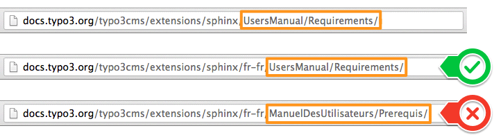

.. ==================================================
.. FOR YOUR INFORMATION
.. --------------------------------------------------
.. -*- coding: utf-8 -*- with BOM.

.. include:: ../../../Includes.txt


.. _docs-typo3-org:

Rendu sur docs.typo3.org
------------------------

Lorsque vous publiez votre extension sur le :abbr:`TER (TYPO3 Extension Repository)`, la documentation
Sphinx/reStructuredText associée est automatiquement compilée et publiée sur le site http://docs.typo3.org à l'URL
:file:`http://docs.typo3.org/typo3cms/extensions/{extension-key}/`.

Par exemple, cette documentation est publiée sur http://docs.typo3.org/typo3cms/extensions/sphinx/.

De plus, une archive zip est créée automatiquement pour chaque combinaison de version et de langue et contient une copie
du rendu HTML (aussi connu sous le nom de "gabarit statique" dans cette extension) et son équivalent PDF (si le rendu
PDF a été activé, voir :ref:`ci-après <docs-typo3-org-pdf>`). Les archives sont stockés sous
:file:`http://docs.typo3.org/typo3cms/extensions/{extension-key}/packages/` :file:`{extension-key}-{version}-{language}.zip`.
Exemples :

- http://docs.typo3.org/typo3cms/extensions/sphinx/packages/sphinx-1.2.0-default.zip
- http://docs.typo3.org/typo3cms/extensions/sphinx/packages/sphinx-1.2.0-fr-fr.zip

La liste des archives disponibles peut être récupérée simplement depuis l'URL
http://docs.typo3.org/typo3cms/extensions/sphinx/packages/packages.xml (vous pouvez bien évidemment remplacer le segment
``/sphinx/`` par n'importe quelle autre clé d'extension).

.. caution::
	Les noms de fichiers et les URIs sont générés en minuscules et avec des tirets en lieu et place de traits de
	soulignement. Cela signifie qu'une documentation avec la langue (ou pour être exacte la *locale*) ``fr_FR`` sera
	en fait accessible en utilisant ``fr-fr``.

.. only:: html

	**Sujets traités dans ce chapitre**

	.. contents::
		:local:
		:depth: 2


Titre, mention de copyright et version
^^^^^^^^^^^^^^^^^^^^^^^^^^^^^^^^^^^^^^

.. index::
	single: Settings.yml (format)

Un projet Sphinx valide pour un manuel d'extension doit contenir un fichier de configuration :file:`Settings.yml` au même
niveau que le document principal :file:`Index.rst`. Ce fichier est votre passe pour surcharger les paramètres par défaut
du fichier de configuration Sphinx réel :file:`conf.py` qui ne fait pas partie de votre projet (étant donné qu'il va
contenir des paramètres liés à l'environnement de compilation sur http://docs.typo3.org). Au lieu de ça, ce fichier de
configuration YAML vous permet de définir certaines options de projet.

De façon similaire, cette extension s'occupe de lire les options de :file:`Settings.yml`, ce qui assure une uniformité
entre le travail local sur votre manuel d'extension et son déploiement automatique sur http://docs.typo3.org.

Un fichier standard :file:`Settings.yml` devrait définir certaines informations générales de projet :

.. code-block:: yaml
	:linenos:

	conf.py:
	  copyright: 2013
	  project: Générateur et visionneuse de documentation Sphinx Python
	  version: 1.2
	  release: 1.2.0

project
	Le nom du projet de documentation.

copyright
	Une mention de copyright du genre ``2013, Nom de l'auteur``.

	.. tip::
		Au sein de la documention TYPO3 officielle, nous ne renseignons généralement que l'année ou l'intervalle
		d'années comme ``2013`` ou ``2010-2013``.

version
	La version majeure du projet, utilisé comme remplacement pour ``|version|``. Par exemple, pour la documentation
	TYPO3, ça pourrait être ``6.2``.

release
	La version complète du projet, utilisé comme remplacement pour ``|release|``. Par exemple, pour la documentation
	TYPO3, ça pourrait être ``6.2.0rc1``.

	Si vous n'avez pas besoin de séparation entre ``version`` et ``release``, vous pouvez simplement définir les deux
	options avec la même valeur.

	.. tip::
		L'auteur de l'extension est bien évidemment libre de choisir son schéma de numérotation des versions mais les
		bonnes pratiques sont de suivre les mêmes règles que pour le noyau TYPO3 et de ne pas introduire de changements
		majeurs ou de nouvelles fonctionalités pour les sorties de nouvelles versions de correction de votre extension
		(lorsque seul le dernier chiffre de la version change).

		Puisque les auteurs d'extensions ont une grande chance d'oublier de mettre à jour la version avant la publication
		de leur extension sur le TER, le moteur de rendu sur http://docs.typo3.org surcharge automatiquement les
		paramètres *version* et *release* en utilisant la valeur effective telle que vue sur le TER.


.. _docs-typo3-org-pdf:

Rendu PDF
^^^^^^^^^

La version PDF de votre documentation est générée en utilisant le générateur LaTeX de Sphinx (cf. :ref:`rendering-pdf`
au besoin) et doit être explicitement activée pour votre extension. Pour se faire, ouvrez le fichier :file:`Settings.yml`
(à la racine de votre dossier de documentation) et assurez-vous qu'il contient les options de configuration suivantes
(lignes 6 à 15) :

.. code-block:: yaml
	:linenos:
	:emphasize-lines: 6-15

	conf.py:
	  copyright: 2013
	  project: Générateur et visionneuse de documentation Sphinx Python
	  version: 1.1
	  release: 1.1.0
	  latex_documents:
	  - - Index
	    - sphinx.tex
	    - Générateur et visionneuse de documentation Sphinx Python
	    - Xavier Perseguers
	    - manual
	  latex_elements:
	    papersize: a4paper
	    pointsize: 10pt
	    preamble: \usepackage{typo3}

Les lignes 7 à 11 définissent les options pour la valeur ``latex_documents`` qui détermine comment regrouper
la structure du document sous forme de fichiers LaTeX. C'est une liste de tuples : ``startdocname``, ``targetname``,
``title``, ``author``, ``documentclass``, où les éléments sont :

startdocname
	Le nom du document qui est la "racine" des fichiers LaTeX. Tous les documents qui sont référencés dans sa table des
	matières seront également inclus dans le fichier LaTeX.

	.. warning::
		Utilisez systématiquement ``Index`` ici.

targetname
	Le nom de fichier LaTeX dans le répertoire de sortie.

	.. warning::
		Utilisez systématiquement votre clé d'extension suivie de ``.tex`` ici.

title
	Le titre de document LaTeX. Il est inséré comme du contenu LaTeX, donc les caractères spéciaux comme la barre oblique
	inversée ou l'esperluette doivent être représentés par les commandes LaTeX correspondantes s'ils ont besoin d'être
	interprétés comme tels.

author
	L'auteur du document LaTeX. Les mêmes considérations que pour le *titre* s'appliquent. Utilisez ``\and`` (**également
	en français**) pour séparer des auteurs multiples, comme dans : ``'John \and Sarah'``.

documentclass
	En principe, soit ``manual`` soit ``howto`` (fournis par Sphinx).

	.. tip::
		Pour garder le design TYPO3, vous devriez utiliser systématiquement ``manual`` ici.

Les lignes 12 à 15 devraient être recopiées telles quelles. La ligne 15 est en fait le "déclencheur" de rendu PDF.

Lorsque le rendu PDF est activé, votre documentation est générée automatiquement sur http://docs.typo3.org à l'URL
:file:`http://docs.typo3.org/typo3cms/extensions/{extension-key}/_pdf/`. Par exemple :
http://docs.typo3.org/typo3cms/extensions/sphinx/_pdf/.

Veuillez lire le chapitre :ref:`customizing-rendering` pour de plus amples informations sur les options de configuration
LaTeX.


.. _docs-typo3-org-multilingual:

Documentation multilingue
^^^^^^^^^^^^^^^^^^^^^^^^^

.. index::
	single: Manuel multilingue

Les manuels d'extensions multilingues sont supportés à la fois par cette extension et par http://docs.typo3.org. Si vous
souhaitez traduire votre documentation, démarrez un nouveau projet Sphinx complet (y.c. :file:`Settings.yml`) dans le
répertoire :file:`Documentation/Localization.{locale}`.

.. tip::
	Vous pouvez réutiliser vos ressources comme :file:`Includes.txt` ou les images de votre documentation principale dans
	le répertoire :file:`Documentation` mais pas dans l'autre sens, c'est-à-dire que vous ne pouvez pas réutiliser des
	ressources spécifiques à un manuel traduit dans votre manuel principal (anglais).

Locales
"""""""

.. index::
	single: Locales

Mis à part pour les quelques préfixes qui sont déjà des "locales", http://docs.typo3.org s'attend à avoir une locale et
pas un code de langue. Par conséquent, assurez-vous d'*étendre* le préfixe en conséquence. Par exemple, une
documentation française (préfixe ``fr``) devrait être étendue soit en ``fr_FR`` (français de France) ou en ``fr_CA``
(français du Canada). Regardez notre liste de suggestions ci-dessous.

Votre manuel d'extension traduit sera généré sur http://docs.typo3.org/typo3cms/extensions/sphinx/fr-fr/ (HTML) et
http://docs.typo3.org/typo3cms/extensions/sphinx/fr-fr/_pdf/ (PDF).

.. note::
	Par convention, la page d'*accueil* (ou d'*arrivée*) d'une documentation devrait être associée à une ancre ``start``.
	En bref, votre fichier :file:`Index.rst` principal devrait être comme ceci :

	.. code-block:: rest

		.. _start:

		===================================
		Titre de votre extension
		===================================

.. caution::
	Les noms de fichiers et les URIs sont générés en minuscules et avec des tirets en lieu et place de traits de
	soulignement. Cela signifie qu'une documentation avec la locale ``fr_FR`` sera en fait accessible en
	utilisant ``fr-fr``.

La liste des langues supportées par Sphinx est :

=======  ======================== ================
Prefixe  Nom                      Locale suggérée
=======  ======================== ================
bn       Bengali                  bn_BD
ca       Catalan                  ca_ES
cs       Tchèque                  cs_CZ
da       Danois                   da_DK
de       Allemand                 de_DE
es       Espagnol                 es_ES
et       Estonien                 et_EE
eu       Basque                   eu_ES
fa       Iranien                  fa_IR
fi       Finnois                  fi_FI
fr       Français                 fr_FR, fr_CA
hr       Croate                   hr_HR
hu       Hongrois                 hu_HU
id       Indonésien               id_ID
it       Italien                  it_IT
ja       Japonais                 ja_JP
ko       Coréen                   ko_KR
lt       Lithuanien               lt_LT
lv       Letton                   lv_LV
mk       Macédonien               mk_MK
nb_NO    Norvégien                nb_NO
ne       Nepalien                 ne_NP
nl       Néerlandais              nl_NL
pl       Polonais                 pl_PL
pt_BR    Portugais du Brésil      pt_BR
ru       Russe                    ru_RU
si       Cingalais                si_LK
sk       Slovaque                 sk_SK
sl       Slovène                  sl_SI
sv       Suédois                  sv_SE
tr       Turc                     tr_TR
uk_UA    Ukrainien                uk_UA
zh_CN    Chinois simplifié        zh_CN
zh_TW    Chinois traditionnel     zh_TW
=======  ======================== ================


Bonnes pratiques
""""""""""""""""

Lorsque vous traduisez une documentation, vous pouvez être tenté de traduire un maximum d'éléments, y compris les noms
de répertoires et de fichiers. Bien que cette idée semble judicieuse de prime abord, nous vous recommandons de **ne pas**
le faire.

En effet, les bonnes pratiques montrent que si vous gardez les noms de répertoires et de fichiers originaux, vous
permettez à vos lecteurs de basculer rapidement entre la version originale et une traduction sur http://docs.typo3.org
puisque le sélecteur de langue (actuellement masqué dans la liste des versions) tente de trouver une URI relative
identique dans les traductions disponibles. S'il trouve une correspondance vers le *même* document, il basculera sur le
même chapitre (mais traduit !), sinon il affichera la page d'accueil.

Ce mécanisme est expliqué par la figure suivante. La deuxième barre d'adresse (documentation française) montre que les
noms de répertoires et de fichiers ont été gardés. Il est donc possible de passer de la version originale, en anglais,
à la traduction française en préfixant le segment d'URI ``fr-fr/``. En revanche, dans la troisième barre d'adresse, les
noms des répertoires et de fichiers ont également été traduits et il n'est donc plus possible de faire correspondre les
chapitres traduits :




.. _docs-typo3-org-crosslink:

Références croisées vers une autre documentation
^^^^^^^^^^^^^^^^^^^^^^^^^^^^^^^^^^^^^^^^^^^^^^^^

Sphinx vous permet de créer facilement des références croisées vers d'autres documentations telles que les manuels et
guides officiels ou les manuels des extensions (pour autant qu'ils aient été écrits avec Sphinx et pas avec OpenOffice)
en préfixant la cible du lien de façon appropriée.

Une construction telle que ``:ref:`stdWrap en détails <t3tsref:stdwrap>``` va créer un lien vers la version stable de la
"Référence TypoScript" officielle de TYPO3, vers le chapitre "stdWrap" :

* :ref:`stdWrap en détails <t3tsref:stdwrap>`

Derrière les coulisses, voici ce qui se passe :

- Chaque rendu HTML Sphinx crée un fichier nommé :file:`objects.inv` qui contient une correspondance entre les ancres et
  les URIs relatives à la racine des fichiers HTML.

- Les projets qui utilisent l'extension Intersphinx peuvent spécifier l'emplacement de tels fichiers de correspondance
  grâce à l'option de configuration ``intersphinx_mapping``. La correspondance sera ensuite utilisée pour résoudre des
  références à des objets sinon manquants vers une autre documentation.

La liste des manuels officiels et leurs préfixes correspondants peut être trouvée sur
http://docs.typo3.org/typo3cms/Index.html.

Vous êtes en mesure de créer des liens vers d'autres documentations de http://docs.typo3.org (ou ailleurs) en configurant
la correspondance Intersphinx dans :file:`Settings.yml`. Pour se faire, ajoutez des options de configuration
(lignes 6 à 9) :

.. code-block:: yaml
	:linenos:
	:emphasize-lines: 6-9

	conf.py:
	  copyright: 2013
	  project: Générateur et visionneuse de documentation Sphinx Python
	  version: 1.2
	  release: 1.2.0
	  intersphinx_mapping:
	    restdoc:
	    - http://docs.typo3.org/typo3cms/extensions/restdoc/
	    - null

Cela aura pour effet d'enregistrer le préfixe ``restdoc`` et vous permettra de créer des références croisées vers
n'importe quel chapitre de la documentation de l'extension *Sphinx/reStructuredText Documentation Viewer*. Par exemple
son journal des modifications avec ``:ref:`Journal des modifications pour EXT:restdoc <restdoc:changelog>```. Par
convention, vous devriez la clé d'extension (sans caractère de soulignement "``_``") comme préfixe vers d'autres
manuels :

* :ref:`Journal des modifications pour EXT:restdoc <restdoc:changelog>`


.. _docs-typo3-org-crosslink-code:

Références croisées vers le code source de TYPO3
^^^^^^^^^^^^^^^^^^^^^^^^^^^^^^^^^^^^^^^^^^^^^^^^

L'astuce décrite dans le chapitre :ref:`advanced-cross-links` a été implémentée pour l'API du code source TYPO3, ce qui
permet de façon très facile de faire des références croisées vers le code source de TYPO3, soit pour une classe donnée,
soit pour une méthode particulière.

Pour être en mesure de créer des références croisées vers l'API de TYPO3, vous devez tout d'abord ajouter une
correspondance Intersphinx. Pour se faire, ouvrez le fichier de configuration :file:`Settings.yml` et ajoutez un bloc
Intersphinx ``t3cmsapi`` :

.. code-block:: yaml
	:linenos:
	:emphasize-lines: 7-9

	conf.py:
	  copyright: 2013
	  project: Générateur et visionneuse de documentation Sphinx Python
	  version: 1.2
	  release: 1.2.0
	  intersphinx_mapping:
	    t3cmsapi:
	    - http://typo3.org/api/typo3cms/
	    - null

Dans votre documentation, vous pouvez ensuite référencer une classe ou une méthode :

.. code-block:: rest

	Consultez :ref:`t3cmsapi:TYPO3\\CMS\\Core\\Utility\\GeneralUtility` pour les méthodes
	standards de l'API.

	Vous pouvez envoyer un email avec
	:ref:`t3cmsapi:TYPO3\\CMS\\Core\\Utility\\MailUtility::mail`.

qui sera rendu comme

	Consultez :ref:`t3cmsapi:TYPO3\\CMS\\Core\\Utility\\GeneralUtility` pour les méthodes
	standards de l'API.

	Vous pouvez envoyer un email avec
	:ref:`t3cmsapi:TYPO3\\CMS\\Core\\Utility\\MailUtility::mail`.

Quelques ancres supplémentaires sont également créées (et sont disponibles comme ``:ref:`t3cmsapi:<ancre>```) :

================== =================================
Ancre              Cible
================== =================================
``deprecated``     :ref:`t3cmsapi:deprecated`
``functions``      :ref:`t3cmsapi:functions`
``functions-func`` :ref:`t3cmsapi:functions-func`
``genindex``       :ref:`t3cmsapi:genindex`
``hierarchy``      :ref:`t3cmsapi:hierarchy`
``modindex``       :ref:`t3cmsapi:modindex`
``pages``          :ref:`t3cmsapi:pages`
``start``          :ref:`t3cmsapi:start`
``test``           :ref:`t3cmsapi:test`
``todo``           :ref:`t3cmsapi:todo`
``variables``      :ref:`t3cmsapi:variables`
================== =================================
