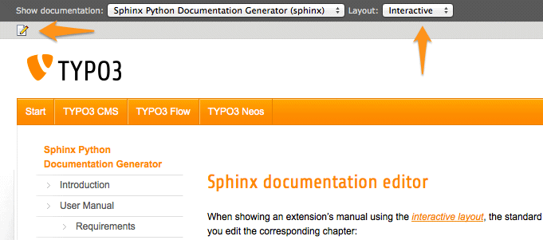
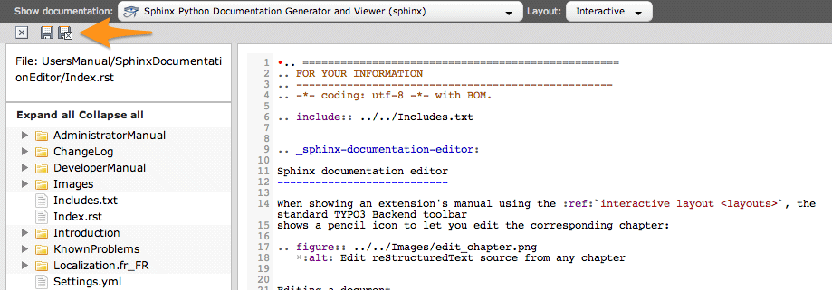

.. ==================================================
.. FOR YOUR INFORMATION
.. --------------------------------------------------
.. -*- coding: utf-8 -*- with BOM.

.. include:: ../../../Includes.txt

.. _sphinx-documentation-editor:

Éditeur de documentation Sphinx
-------------------------------

Lorsque vous affichez un manuel d'extension en utilisant le :ref:`gabarit interactif <layouts>`, la barre d'outils
standard de TYPO3 affiche une icône de crayon pour vous permettre de modifier le chapitre correspondant :

.. tip::
	Vous pouvez également utiliser le raccourci clavier **Ctrl+E** ou **Cmd+E** pour passer en mode édition.

Modification d'un document
^^^^^^^^^^^^^^^^^^^^^^^^^^

L'icône de crayon charge l'éditeur "CodeMirror" (http://codemirror.net/).

Cet éditeur vous permet de mettre à jour rapidement le chapitre correspondant ou, par la suite, n'importe quel fichier
de votre project Sphinx, et de générer à nouveau la documentation lorsque vous cliquez sur l'icône "enregistrer et
fermer" :

**Raccourcis clavier :**

- **Ctrl+S** / **Cmd+S** : sauvegarde le document
- **Maj+Ctrl+S** / **Maj+Cmd+S** : sauvegarde et ferme le document (et donc génère à nouveau la documentation)
- **Esc** / **Alt+W** / **Ctrl+W** : ferme le document

Liens croisés
^^^^^^^^^^^^^

Sur le côté droit, un panneau vous montre un navigateur de références au sein de votre documentation. Les
références sont groupées par chapitre sous la forme d'un accordéon :

.. figure:: ../../../Images/references-browser.png
	:alt: Navigateur de références

Tout en haut, vous trouvez une zone de texte qui vous permet d'afficher les références de toutes les extensions
et les manuels officiels dotés d'une documentation basée sur reStructuredText/Sphinx. Il vous suffit de taper
une clé d'extension, une partie du titre d'une extension ou quelques mots issus de sa description et de
sélectionner l'entrée correspondante grâce au mécanisme de complètement automatique.

.. only:: latex or missing_sphinxcontrib_youtube

	Une fois que vous avez trouvé la référence qui vous intéresse, il vous suffit de cliquer sur celle-ci pour
	l'insérer avec la syntaxe reStructuredText correcte dans votre document.

.. only:: html and not missing_sphinxcontrib_youtube

	Une fois que vous avez trouvé la référence qui vous intéresse, il vous suffit de cliquer sur celle-ci pour
	l'insérer avec la syntaxe reStructuredText correcte dans votre document :

	.. youtube:: TShEf6YkREA
		:width: 100%

	|

Si la référence que vous insérez n'est pas issue de votre documentation (c.-à-d. que vous référencez un autre
chapitre ou section) mais est une référence croisée vers un autre document, la partie Intersphinx de votre
fichier de configuration :file:`Settings.yml` sera automatiquement mise à jour afin que la génération s'effectue avec
succès. Au besoin, veuillez lire la section :ref:`docs-typo3-org-crosslink` pour plus d'informations.

.. tip::
	Depuis la version 1.3.0, vous pouvez insérer des références croisées manuellement et, pour autant que vous utilisiez
	un préfixe officiel (tel que "t3cmsapi", "t3tsref", ...) ou une clé d'extension, l'éditeur mettra automatiquement à
	jour, au besoin, la correspondance Intersphinx dans le fichier de configuration :file:`Settings.yml`.
