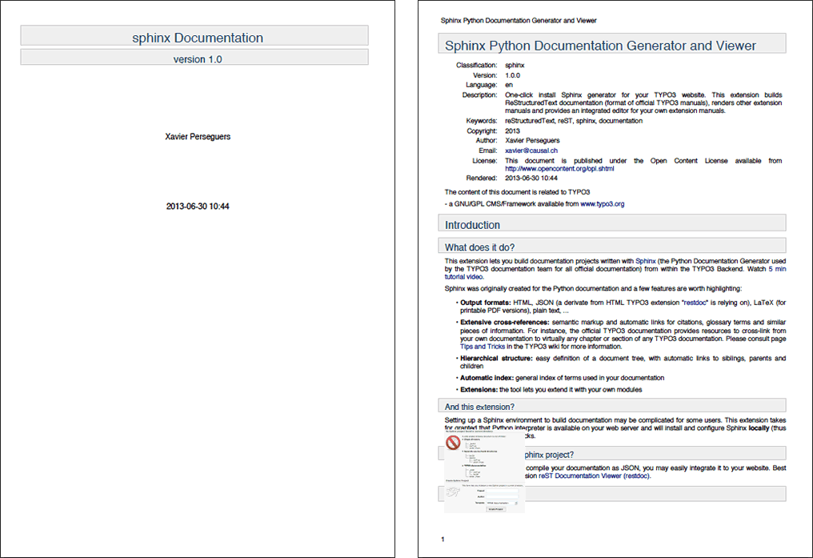
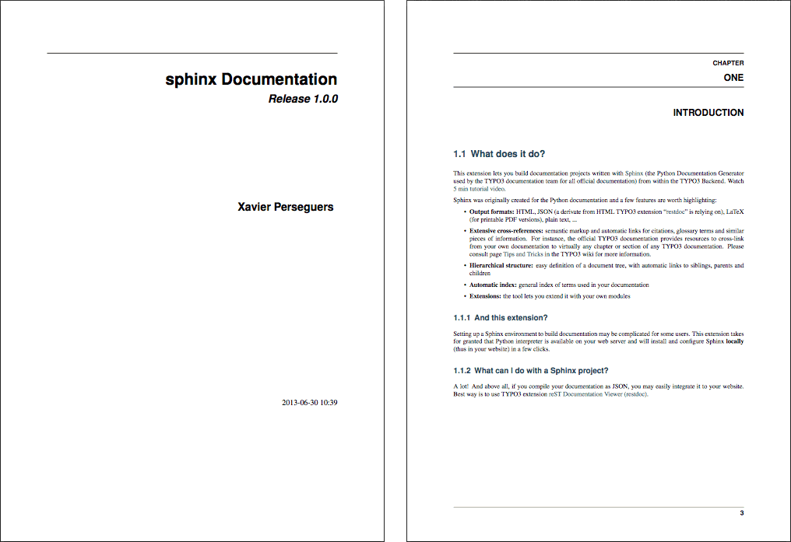

.. ==================================================
.. FOR YOUR INFORMATION
.. --------------------------------------------------
.. -*- coding: utf-8 -*- with BOM.

.. include:: ../../Includes.txt

LaTeX versus rst2pdf
^^^^^^^^^^^^^^^^^^^^

In an attempt to convince you that LaTeX output is indeed much prettier and professional, we rendered the documentation
you are currently reading once with :program:`rst2pdf`:

and then with LaTeX:

The files were generated without any special configuration nor tuning.

.. note::
	One drawback of LaTeX is that it can only be installed globally on your system; this is the reason why this
	extension does not provide a wizard in Extension Manager to install and configure it automatically for you.
