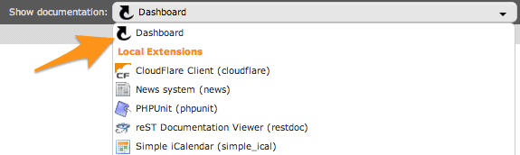
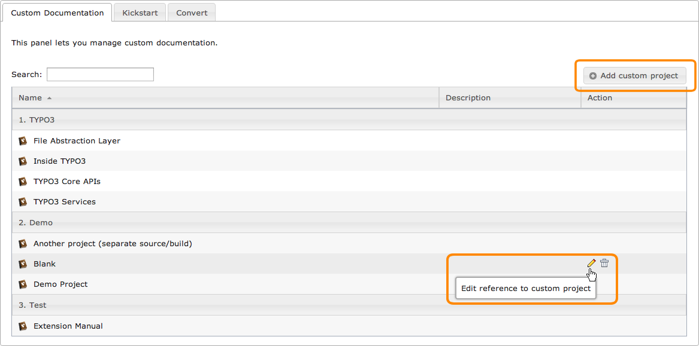

.. ==================================================
.. FOR YOUR INFORMATION
.. --------------------------------------------------
.. -*- coding: utf-8 -*- with BOM.

.. include:: ../../Includes.txt

.. _sphinx-documentation-viewer:

Sphinx documentation viewer
---------------------------

This extension provides a backend module under section "Help":

.. figure:: ../../Images/section_help.png
	:alt: Sphinx documentation viewer

A drop-down menu on top lists all loaded extensions that are featuring a Sphinx-based documentation and lets you quickly
show it **locally**:

.. figure:: ../../Images/viewer_choose_extension.png
	:alt: Selector to show an extension manual locally

.. tip::
	The Sphinx documentation viewer automatically reloads the last manual you selected and if you choose the interactive
	layout, it will even bring you to the chapter you were reading.

.. _dashboard:
.. _documentation-viewer-custom-project:
.. _kickstart-sphinx-project:

Dashboard
^^^^^^^^^

If no documentation have been selected in the drop-down menu; that is, "Dashboard" is selected:

a list of custom projects may be managed:

Then, depending on your environment, up to two additional tabs may be present. One that shows a list of
locally-available extensions with an OpenOffice manual only. Action icons let you easily convert their manual to Sphinx
using a standalone OpenOffice to Sphinx converter built-in this extension:

.. figure:: ../../Images/convert-openoffice.png
	:alt: Easily convert OpenOffice manuals to Sphinx projects

Similarly, an empty Sphinx documentation project may be created for local extensions without any manual yet:

.. figure:: ../../Images/kickstart-sphinx.png
	:alt: Kickstart a Sphinx documentation project

.. _layouts:

Layouts
^^^^^^^

Extension manuals may be rendered with different "layouts":

- **Static:** This renders and shows the HTML version;

- **Interactive:** This renders and shows the JSON version and as such requires
  extension :ter:`Sphinx Documentation Viewer Plugin (restdoc) <restdoc>`. In addition, this layout features
  an integrated :ref:`reStructuredText editor <sphinx-documentation-editor>` to let you quickly edit and recompile a
  given chapter;

- **PDF:** This renders and shows the PDF version and as such requires either :program:`pdflatex` or :program:`rst2pdf`:

  .. figure:: ../../Images/render_pdf.png
      :alt: Render a documentation as PDF

Internals
^^^^^^^^^

As Sphinx-based extension manuals are meant to be rendered on https://docs.typo3.org using the TYPO3 corporate design,
they do not provide the general configuration files needed to be rendered locally.

When selecting an extension's manual to be shown from the drop-down menu the following process happens:

- If a cached version of the main document is found, the viewer loads it right away and does not compile the documentation.

Otherwise:

#. An empty Sphinx project is instantiated within :file:`typo3temp/tx_sphinx/{extension-key}` and all files from
   :file:`EXT:{extension-key}/Documentation` are copied in this directory

#. The Sphinx project is built as HTML, JSON or PDF, according to selected layout

#. HTML, JSON or PDF output is copied to :file:`typo3conf/documentation/{extension-key}/` :file:`{language}/{format}/`
   (``language`` is always "default" for English, unless a multilingual documentation is found, just as this extension
   does for French)

#. The viewer loads the main document (e.g., :file:`Index.html` with HTML output)

|

.. tip::
	A button on the right lets you force the extension's manual to be recompiled (thus recreating the cached version):

	.. image:: ../../Images/render-again.png
		:alt: Button to force an extension manual to be rendered

.. note::
	The Sphinx Documentation Viewer supports two types of extension's manual:

	#. Standard documentation layout with the a whole Sphinx project stored within :file:`EXT:{extension-key}/Documentation/`,
	   with the master document named :file:`Index.rst`
	#. Simple reStructuredText README file as seen on Github or Bitbucket and saved as :file:`EXT:{extension-key}/README.rst`

According to the selected layout, the main document is:

- **Static:** Main document of HTML output is :file:`typo3conf/Documentation/{extension-key}/` :file:`default/html/Index.html`

- **Interactive:** Main document of JSON output is :file:`typo3conf/Documentation/{extension-key}/` :file:`default/json/Index.fjson`

- **PDF:** Main document of PDF output is :file:`typo3conf/Documentation/{extension-key}/` :file:`default/pdf/{extension-key}.pdf`
