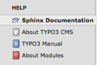
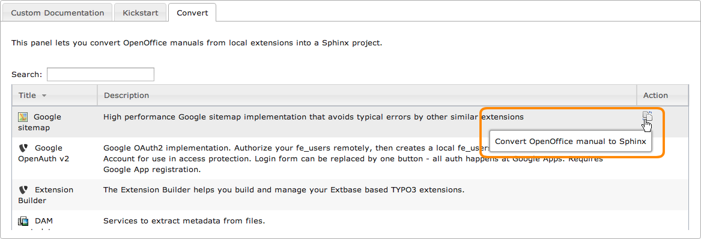

.. ==================================================
.. FOR YOUR INFORMATION
.. --------------------------------------------------
.. -*- coding: utf-8 -*- with BOM.

.. include:: ../../Includes.txt

.. _sphinx-documentation-viewer:

Sphinx documentation viewer
---------------------------

This extension provides a backend module under section "Help":

A drop-down menu on top lists all loaded extensions that are featuring a Sphinx-based documentation and lets you quickly
show it **locally**:

.. figure:: ../../Images/viewer_choose_extension.png
	:alt: Selector to show an extension manual locally
	:width: 711

.. tip::
	The Sphinx documentation viewer automatically reloads the last manual you selected and if you choose the interactive
	layout, it will even bring you to the chapter you were reading.

.. _kickstart-sphinx-project:

Dashboard
^^^^^^^^^

If no documentation has been selected in the drop-down menu; that is, "Dashboard" is selected:

.. figure:: ../../Images/kickstart.png
	:alt: No documentation selected

a list of locally available extensions with an OpenOffice manual only is shown and lets you easily convert it to Sphinx
using an online tool on http://docs.typo3.org:

Similarly, an empty Sphinx documentation project may be created for local extensions without any manual yet:

.. figure:: ../../Images/kickstart-sphinx.png
	:alt: Kickstart a Sphinx documentation project
	:width: 711

.. _layouts:

Layouts
^^^^^^^

Extension manuals may be rendered with different "layouts":

- **Static:** This renders and shows the HTML version;

- **Interactive:** This renders and shows the JSON version and as such requires extension
  `Sphinx/reStructuredText Documentation Viewer (restdoc)`_. In addition, this layout features an integrated
  :ref:`reStructuredText editor <sphinx-documentation-editor>` to let you quickly edit and recompile a given chapter;

- **PDF:** This renders and shows the PDF version and as such requires either :program:`pdflatex` or :program:`rst2pdf`:

  .. figure:: ../../Images/render_pdf.png
      :alt: Render a documentation as PDF
      :width: 691

.. _`Sphinx/reStructuredText Documentation Viewer (restdoc)`: http://typo3.org/extensions/repository/view/restdoc

Internals
^^^^^^^^^

As Sphinx-based extension manuals are meant to be rendered on http://docs.typo3.org using the TYPO3 corporate design,
they do not provide the general configuration files needed to be rendered locally.

When selecting an extension's manual to be shown from the drop-down menu the following process happens:

- If a cached version of the main document is found, the viewer loads it right away and does not compile the documentation.

Otherwise:

#. An empty Sphinx project is instantiated within :file:`typo3temp/tx_sphinx/{extension-key}` and all files from
   :file:`EXT:{extension-key}/Documentation` are copied in this directory

#. The Sphinx project is built as HTML, JSON or PDF, according to selected layout

#. HTML, JSON or PDF output is copied to :file:`typo3conf/documentation/{extension-key}/` :file:`{language}/{format}/`
   (``language`` is always "default" for English, unless a multilingual documentation is found, just as this extension
   does for French)

#. The viewer loads the main document (e.g., :file:`Index.html` with HTML output)

|

.. tip::
	A checkbox on the right lets you force the extension's manual to be recompiled (thus recreating the cached version):

	.. image:: ../../Images/checkbox.png
		:alt: Checkbox to force an extension manual to be rendered

.. note::
	The Sphinx Documentation Viewer supports two types of extension's manual:

	#. Standard documentation layout with the a whole Sphinx project stored within :file:`EXT:{extension-key}/Documentation/`,
	   with the master document named :file:`Index.rst`
	#. Simple reStructuredText README file as seen on Github or Bitbucket and saved as :file:`EXT:{extension-key}/README.rst`

According to the selected layout, the main document is:

- **Static:** Main document of HTML output is :file:`typo3conf/Documentation/{extension-key}/` :file:`default/html/Index.html`

- **Interactive:** Main document of JSON output is :file:`typo3conf/Documentation/{extension-key}/` :file:`default/json/Index.fjson`

- **PDF:** Main document of PDF output is :file:`typo3conf/Documentation/{extension-key}/` :file:`default/pdf/{extension-key}.pdf`

.. _documentation-viewer-custom-project:

Registering a custom project
^^^^^^^^^^^^^^^^^^^^^^^^^^^^

If you have a complete Sphinx project somewhere in your website, such as project you kickstarted with
the :ref:`Sphinx Console <kickstart-sphinx-project>`, you may register it with the Sphinx Documentation Viewer.

In fact, we implemented our own signal for :ref:`registering custom documentation <register-custom-documentation>`.

The list of custom projects is stored within file :file:`typo3conf/sphinx-projects.json`. If this file does not exist,
simply create it with your preferred text editor:

.. code-block:: json

	[
	  {
	    "name": "My Custom Project ABC",
	    "description": "Custom project ABC describing...",
	    "group": "Company Name",
	    "key": "company.project.abc",
	    "directory": "fileadmin/restructuredtext-projects/abc/"
	  },
	  {
	    "name": "My Custom Project DEF",
	    "description": "Custom project describing...",
	    "group": "Company Name",
	    "key": "company.project.def",
	    "directory": "fileadmin/restructuredtext-projects/def/"
	  }
	]

When you do so, your project will appear in the list of documents and you will be able to render it just as any
documentation of an extension.

.. caution::
	MS Windows users may experience that their list of custom projects "is not loaded". This may due to the file
	``typo3conf/sphinx-projects.json`` being encoded as UTF-8 with `BOM <http://en.wikipedia.org/wiki/Byte_order_mark>`_
	whereas your web server expects it *not* to contain BOM.
