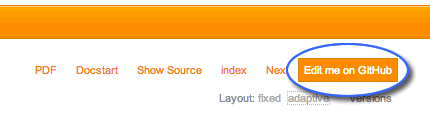

.. ==================================================
.. FOR YOUR INFORMATION
.. --------------------------------------------------
.. -*- coding: utf-8 -*- with BOM.

.. include:: ../../Includes.txt


.. _docs-typo3-org:

Rendering on docs.typo3.org
---------------------------

When you upload your extension to the :abbr:`TER (TYPO3 Extension Repository)`, the associated
Sphinx/reStructuredText-based documentation gets automatically rendered on https://docs.typo3.org under
:file:`https://docs.typo3.org/typo3cms/extensions/{extension-key}/`.

For instance, this documentation gets rendered to https://docs.typo3.org/typo3cms/extensions/sphinx/.

In addition, a zip archive is automatically created for each combination of version and language and contains a copy of
the HTML output (a.k.a. "static layout" within this extension) and its PDF counterpart (if activated, see
:ref:`below <docs-typo3-org-pdf>`). Archives are stored within
:file:`https://docs.typo3.org/typo3cms/extensions/{extension-key}/packages/` :file:`{extension-key}-{version}-{language}.zip`.
E.g.,

- https://docs.typo3.org/typo3cms/extensions/sphinx/packages/sphinx-1.2.0-default.zip
- https://docs.typo3.org/typo3cms/extensions/sphinx/packages/sphinx-1.2.0-fr-fr.zip

The list of available packages can be seen on https://docs.typo3.org/typo3cms/extensions/sphinx/packages/packages.xml
(you may of course replace segment ``/sphinx/`` with any other extension key).

.. caution::
	Files and URIs are generated lower-case and with dashes instead of underscores. This means that a documentation
	with language (or to be exact *locale*) ``fr_FR`` will be accessible using ``fr-fr`` instead.

.. only:: html

	**Topics in this chapter**

	.. contents::
		:local:
		:depth: 2


Title, copyright and version
^^^^^^^^^^^^^^^^^^^^^^^^^^^^

.. index::
	single: Settings.yml; Format

A valid Sphinx project for an extension manual should contain a configuration file :file:`Settings.yml` next to the main
document :file:`Index.rst`. This file is your key to override default settings from the real Sphinx configuration file
:file:`conf.py` which is not part of your project (because it contains settings related to the build environment on
https://docs.typo3.org). Instead, this YAML configuration file lets you define project options.

This extension takes care of loading options from :file:`Settings.yml` as well, thus ensuring a smooth experience when
working locally on your extension manuals before their automatic deployment to https://docs.typo3.org.

A basic :file:`Settings.yml` file should define a few basic project information:

.. code-block:: yaml
	:linenos:

	conf.py:
	  copyright: 2013-2015
	  project: Sphinx Python Documentation Generator and Viewer
	  version: 2.2
	  release: 2.2.1

project
	The documented project's name.

copyright
	A copyright statement in the style ``2015, Author Name``.

	.. tip::
		Within TYPO3 official documentation, we usually only show the year(s) of copyright, e.g., ``2015``
		or ``2010-2015``.

version
	The major project version, used as the replacement for ``|version|``. For example, for the TYPO3
	documentation, this may be something like ``6.2``.

release
	The full project version, used as the replacement for ``|release|``. For example, for the TYPO3 documentation, this
	may be something like ``6.2.0rc1``.

	If you don't need the separation provided between ``version`` and ``release``, just set them both to
	the same value.

	.. tip::
		This is of course up to the extension's author to decide on a version numbering scheme but best practices follow
		the same rules as for TYPO3 core and do not introduce breaking changes or new features in patch-release
		versions (when the last of the three digits changes).

		As extension authors are very likely to forget to update the version prior to uploading their extension to TER,
		the rendering engine on https://docs.typo3.org automatically overrides the *version* and *release* parameters
		to the actual version as seen on TER.


.. _docs-typo3-org-pdf:

PDF rendering
^^^^^^^^^^^^^

.. index::
	single: Settings.yml; LaTeX options
	single: Settings.yml; PDF configuration

The PDF of your documentation is rendered using the LaTeX builder from Sphinx (see :ref:`rendering-pdf` if needed)
and should be explicitly activated for your extension. To do so, open file :file:`Settings.yml` (at the root of your
documentation folder) and make sure it contains following configuration options (lines 6 to 15):

.. code-block:: yaml
	:linenos:
	:emphasize-lines: 6-15

	conf.py:
	  copyright: 2013-2015
	  project: Sphinx Python Documentation Generator and Viewer
	  version: 2.2
	  release: 2.2.1
	  latex_documents:
	  - - Index
	    - sphinx.tex
	    - Sphinx Python Documentation Generator and Viewer
	    - Xavier Perseguers
	    - manual
	  latex_elements:
	    papersize: a4paper
	    pointsize: 10pt
	    preamble: \usepackage{typo3}

Lines 7 to 11 define options for value ``latex_documents`` which determines how to group the document tree into LaTeX
source files. This is a list of tuples: ``startdocname``, ``targetname``, ``title``, ``author``, ``documentclass``, where
the items are:

startdocname
	Document name that is the "root" of the LaTeX files. All documents referenced by it in TOC trees will be included
	in the LaTeX file too.

	.. warning::
		Always use ``Index`` here.

targetname
	File name of the LaTeX file in the output directory.

	.. warning::
		Always use your extension key followed by ``.tex`` here.

title
	LaTeX document title. This is inserted as LaTeX markup, so special characters like a backslash or ampersand must be
	represented by the proper LaTeX commands if they are to be inserted literally.

author
	Author for the LaTeX document. The same LaTeX markup caveat as for *title* applies. Use ``\and`` to separate
	multiple authors, as in: ``'John \and Sarah'``.

documentclass
	Normally, one of ``manual`` or ``howto`` (provided by Sphinx).

	.. tip::
		To keep TYPO3 branding, you should always use ``manual`` here.

Lines 12 to 15 should be kept as-this. Line 15 is actually the "trigger" for PDF rendering.

When activated, your PDF gets automatically rendered on https://docs.typo3.org under
:file:`https://docs.typo3.org/typo3cms/extensions/{extension-key}/_pdf/`. E.g.,
https://docs.typo3.org/typo3cms/extensions/sphinx/_pdf/.

Please read chapter :ref:`customizing-rendering` for further information on LaTeX configuration options.


.. _docs-typo3-org-multilingual:

Multilingual documentation
^^^^^^^^^^^^^^^^^^^^^^^^^^

.. index::
	single: Manual; Multilingual
	single: Manual; Translation
	single: Translation

Multilingual exension manuals are supported by both this extension and https://docs.typo3.org. If you want to translate
your documentation, kickstart a new Sphinx project (incl. :file:`Settings.yml`) within directory
:file:`Documentation/Localization.{locale}`.

.. tip::
	You may reuse assets such as :file:`Includes.txt` or images from the main documentation under
	directory :file:`Documentation` but not the other way around, so you cannot reuse assets from a
	translated manual within the main (English) manual.


Locales
"""""""

.. index::
	single: Translation; Available locales
	single: Locales

Unless for the few prefixes which are already "locales", https://docs.typo3.org expects a locale and not a language code
to be used; so make sure to extend the prefix accordingly. E.g., a French documentation (prefix ``fr``) should be
extended either to ``fr_FR`` (French France) or ``fr_CA`` (French Canada). See our list of suggestions below.

Your translated exension manual will get rendered to https://docs.typo3.org/typo3cms/extensions/sphinx/fr-fr/ (HTML) and
https://docs.typo3.org/typo3cms/extensions/sphinx/fr-fr/_pdf/ (PDF).

.. caution::
	Files and URIs are generated lower-case and with dashes instead of underscores. This means that a documentation
	with locale ``fr_FR`` will be accessible using ``fr-fr`` instead.

The list of supported languages for Sphinx is:

======  ======================== ================
Prefix  Name                     Suggested Locale
======  ======================== ================
bn      Bengali                  bn_BD
ca      Catalan                  ca_ES
cs      Czech                    cs_CZ
da      Danish                   da_DK
de      German                   de_DE
es      Spanish                  es_ES
et      Estonian                 et_EE
eu      Basque                   eu_ES
fa      Iranian                  fa_IR
fi      Finnish                  fi_FI
fr      French                   fr_FR, fr_CA
hr      Croatian                 hr_HR
hu      Hungarian                hu_HU
id      Indonesian               id_ID
it      Italian                  it_IT
ja      Japanese                 ja_JP
ko      Korean                   ko_KR
lt      Lithuanian               lt_LT
lv      Latvian                  lv_LV
mk      Macedonian               mk_MK
nb_NO   Norwegian Bokmal         nb_NO
ne      Nepali                   ne_NP
nl      Dutch                    nl_NL
pl      Polish                   pl_PL
pt_BR   Brazilian Portuguese     pt_BR
ru      Russian                  ru_RU
si      Sinhala                  si_LK
sk      Slovak                   sk_SK
sl      Slovenian                sl_SI
sv      Swedish                  sv_SE
tr      Turkish                  tr_TR
uk_UA   Ukrainian                uk_UA
zh_CN   Simplified Chinese       zh_CN
zh_TW   Traditional Chinese      zh_TW
======  ======================== ================


Best practices
""""""""""""""

When translating a documentation, you may be tempted to translate everything, including directory and file names.
Although this sounds reasonable at first sight, we advise you **not** to do so.

In fact, best practices show that if you keep the original directory and file names, you let readers quickly switch back
and forth from a chapter to its translation on https://docs.typo3.org because the language switch (currently hidden in the
"version" dropdown) simply searches for the same relative URI in the translated documentation. If it finds the *same*
document, it will go to the very same chapter (but translated!) otherwise it will go to the start page.

This is depicted by the following figure. The second navigation bar (French documentation) shows that directory and file
names have been preserved. It is thus possible to switch from the original, in English, to the French translation by
prefixing the URI segment ``fr-fr/``. In the third navigation bar however, the directory and files names have been
translated as well, making it impossible to match chapters with their translated counterparts:

.. figure:: ../../Images/translated-uri-segments.png
	:alt: Translating URI segments


.. _docs-typo3-org-crosslink:

Cross-link to other documentation
^^^^^^^^^^^^^^^^^^^^^^^^^^^^^^^^^

.. index::
	single: Cross-link
	single: Link; To official TYPO3 manual/guide
	single: Link; To other extension's manual

Sphinx lets you easily cross-link to other documentation such as official manuals and guides or extensions' manuals
(granted that they have been written with Sphinx and not in OpenOffice) by prefixing the link target appropriately.

A construction like ``:ref:`stdWrap in details <t3tsref:stdwrap>``` will create a link to the stable version of the
official TYPO3 "TypoScript Reference", within chapter "stdWrap":

* :ref:`stdWrap in details <t3tsref:stdwrap>`

Behind the scenes, this works as follows:

- Each Sphinx HTML build creates a file named :file:`objects.inv` that contains a mapping from object names to URIs
  relative to the HTML set’s root.

- Projects using the Intersphinx extension can specify the location of such mapping files in the ``intersphinx_mapping``
  config value. The mapping will then be used to resolve otherwise missing references to objects into links to the other
  documentation.

The list of official manuals and corresponding prefixes may be found on https://docs.typo3.org/typo3cms/Index.html.

.. note::
	By convention the *start* (or *landing*) page of a documentation should be mapped to anchor ``start``. In short, your
	main :file:`Index.rst` file should thus read:

	.. code-block:: rest

		.. _start:

		===================================
		Title of your extension
		===================================

You may link to any other documentation on https://docs.typo3.org (or elsewhere) by configuring the Intersphinx mapping
within :file:`Settings.yml`. To do so, add configuration options (lines 6 to 9):

.. code-block:: yaml
	:linenos:
	:emphasize-lines: 6-9

	conf.py:
	  copyright: 2013-2015
	  project: Sphinx Python Documentation Generator and Viewer
	  version: 2.2
	  release: 2.2.1
	  intersphinx_mapping:
	    restdoc:
	    - https://docs.typo3.org/typo3cms/extensions/restdoc/
	    - null

This will register prefix ``restdoc`` and let us link to any chapter of the documentation of extension
*Sphinx Documentation Viewer Plugin*. For instance its ChangeLog with
``:ref:`ChangeLog for EXT:restdoc <restdoc:changelog>```. By convention, you should use the extension key (without
underscore "``_``") as prefix for other manuals:

* :ref:`ChangeLog for EXT:restdoc <restdoc:changelog>`


.. _docs-typo3-org-crosslink-code:

Cross-link to TYPO3 source code
^^^^^^^^^^^^^^^^^^^^^^^^^^^^^^^

.. index::
	single: Link; To TYPO3 API (code)

The trick described in chapter :ref:`advanced-cross-links` has been implemented for the TYPO3 source code API, making it
possible and very easy to cross-link to the TYPO3 source code, either for a given class or even a given method.

To be able to cross-link to the TYPO3 API, you first need to add an Intersphinx mapping. To do so, open configuration
file :file:`Settings.yml` and add an Intersphinx mapping ``t3cmsapi``:

.. code-block:: yaml
	:linenos:
	:emphasize-lines: 7-9

	conf.py:
	  copyright: 2013-2015
	  project: Sphinx Python Documentation Generator and Viewer
	  version: 2.2
	  release: 2.2.1
	  intersphinx_mapping:
	    t3cmsapi:
	    - http://typo3.org/api/typo3cms/
	    - null

In your documentation, you may then either link to a given class or a method:

.. code-block:: rest

	See :ref:`t3cmsapi:TYPO3\\CMS\\Core\\Utility\\GeneralUtility` for
	standard API methods.

	You may send an email with
	:ref:`t3cmsapi:TYPO3\\CMS\\Core\\Utility\\MailUtility::mail`.

which will be rendered as

	See :ref:`t3cmsapi:TYPO3\\CMS\\Core\\Utility\\GeneralUtility` for
	standard API methods.

	You may send an email with
	:ref:`t3cmsapi:TYPO3\\CMS\\Core\\Utility\\MailUtility::mail`.

A few additional anchors are created as well (available as ``:ref:`t3cmsapi:<anchor>```):

================== =================================
Anchor             Target
================== =================================
``deprecated``     :ref:`t3cmsapi:deprecated`
``functions``      :ref:`t3cmsapi:functions`
``functions-func`` :ref:`t3cmsapi:functions-func`
``genindex``       :ref:`t3cmsapi:genindex`
``hierarchy``      :ref:`t3cmsapi:hierarchy`
``modindex``       :ref:`t3cmsapi:modindex`
``pages``          :ref:`t3cmsapi:pages`
``start``          :ref:`t3cmsapi:start`
``test``           :ref:`t3cmsapi:test`
``todo``           :ref:`t3cmsapi:todo`
``variables``      :ref:`t3cmsapi:variables`
================== =================================


.. _docs-typo3-org-edit-github:

Let visitors edit manual on GitHub
^^^^^^^^^^^^^^^^^^^^^^^^^^^^^^^^^^

.. index::
	single: Collaboration; GitHub
	single: GitHub; Button "Edit me GitHub"
	single: Settings.yml; GitHub options
	single: GitHub; github_repository
	single: GitHub; github_branch

In case your extension is hosted on GitHub, you may want to let visitors of https://docs.typo3.org
edit the documentation of your extension by pressing a button "Edit me on GitHub":



This button is not shown by default. To make the button visible, you need to
specify the relative URI of your GitHub project repository and the branch you want
to use for documentation changes (typically "master") in the configuration file :file:`Documentation/Settings.yml`
in your repository:

.. code-block:: yaml
	:linenos:
	:emphasize-lines: 6-8

	conf.py:
	  copyright: 2013-2015
	  project: Sphinx Python Documentation Generator and Viewer
	  version: 2.2
	  release: 2.2.1
	  html_theme_options:
	    github_repository: xperseguers/t3ext-sphinx
	    github_branch: master

where ``xperseguers/t3ext-sphinx`` is the relative URI in ``http://github.com/xperseguers/t3ext-sphinx``.

The button will be visible the next time you publish your extension to TER.

.. note::
	Every official TYPO3 manual, guide and reference is using this option, making it a breeze to contribute if you
	spot a typo or wish something got rephrased or better explained.
