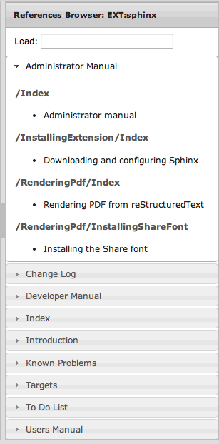

.. ==================================================
.. FOR YOUR INFORMATION
.. --------------------------------------------------
.. -*- coding: utf-8 -*- with BOM.

.. include:: ../../Includes.txt

.. _sphinx-documentation-editor:

Sphinx documentation editor
---------------------------

When showing an extension's manual using the :ref:`interactive layout <layouts>`, the standard TYPO3 backend toolbar
shows a pencil icon to let you edit the corresponding chapter:

.. figure:: ../../Images/edit_chapter.png
	:alt: Edit reStructuredText source from any chapter

.. tip::
	You may use keyboard shortcut **Ctrl+E** or **Cmd+E** to toggle to edit mode.

Editing a document
^^^^^^^^^^^^^^^^^^

The pencil icon loads the "CodeMirror editor" (http://codemirror.net/).

This editor lets you quickly update the corresponding chapter, or then any file within your Sphinx project, and recompile
the documentation if you click on toolbar icon "save and close":

.. figure:: ../../Images/save_compile.png
	:alt: Save and compile your reStructuredText chapter

**Keyboard shorcuts:**

- **Ctrl+S** / **Cmd+S** : saves the document
- **Shift+Ctrl+S** / **Shift+Cmd+S** : saves and closes the document (thus recompiles the documentation)
- **Esc** / **Alt+W** / **Ctrl+W** : closes the document

Cross-linking
^^^^^^^^^^^^^

On the right side, a panel provides a browser of references within your documentation. The references are
grouped by chapter using a accordion widget:

At the beginning an input box lets you show the references of any other extension or official manual providing
a reStructuredText/Sphinx-based documentation. Just type an extension key, part of the extension title or some
words from its description and selects it using the autocompletion mechanism.

.. only:: latex or missing_sphinxcontrib_youtube

	Once you have found the reference you are interested in, using it is just a matter of clicking on its name
	to insert it using the proper reStructuredText syntax in your document.

.. only:: html and not missing_sphinxcontrib_youtube

	Once you have found the reference you are interested in, using it is just a matter of clicking on its name
	to insert it using the proper reStructuredText syntax in your document:

	.. youtube:: TShEf6YkREA
		:width: 100%

	|

In case the reference you insert is not coming from your documentation (that is, you are referencing another
chapter or section) but is a cross-reference to another document, the Intersphinx mapping of your configuration
file :file:`Settings.yml` will be automatically updated in order for the rendering to succeed. You may want to read
section :ref:`docs-typo3-org-crosslink` for additional information.

.. tip::
	Since version 1.3.0, you may manually insert cross-references and as long as you use an official prefix (such as
	"t3cmsapi", "t3tsref", ...) or an extension key, the editor will automatically update your Intersphinx mapping
	in configuration file :file:`Settings.yml`, if needed.
